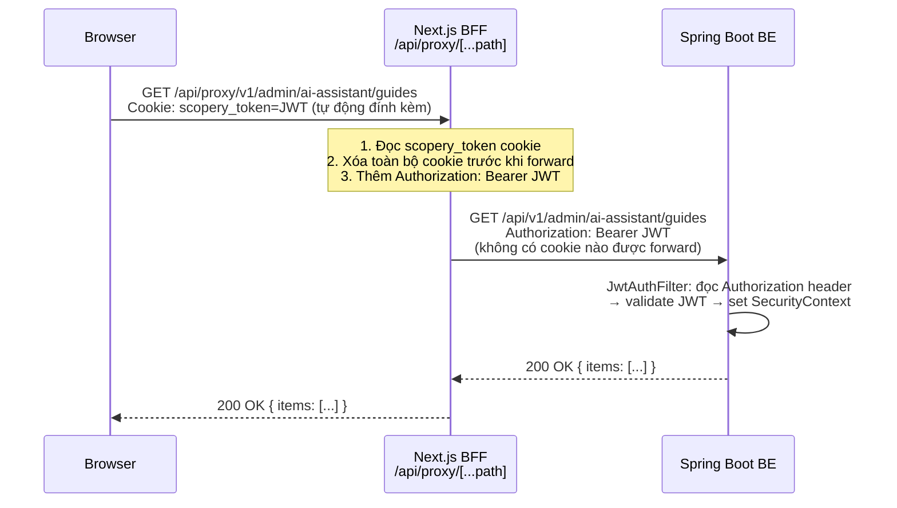
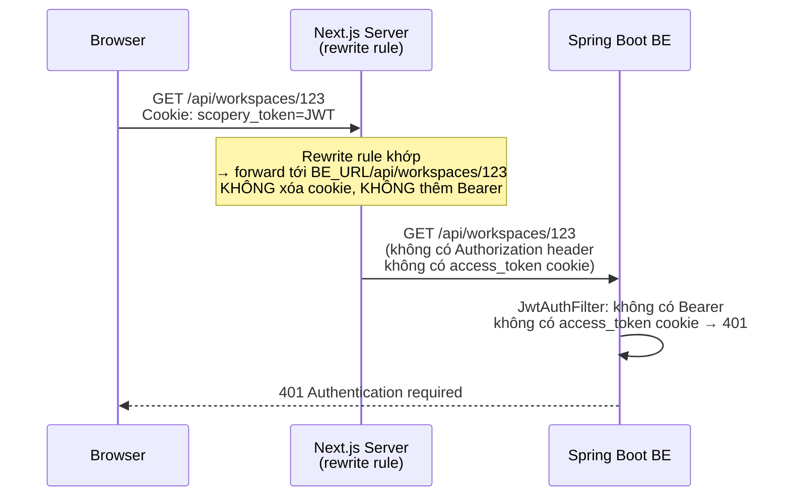
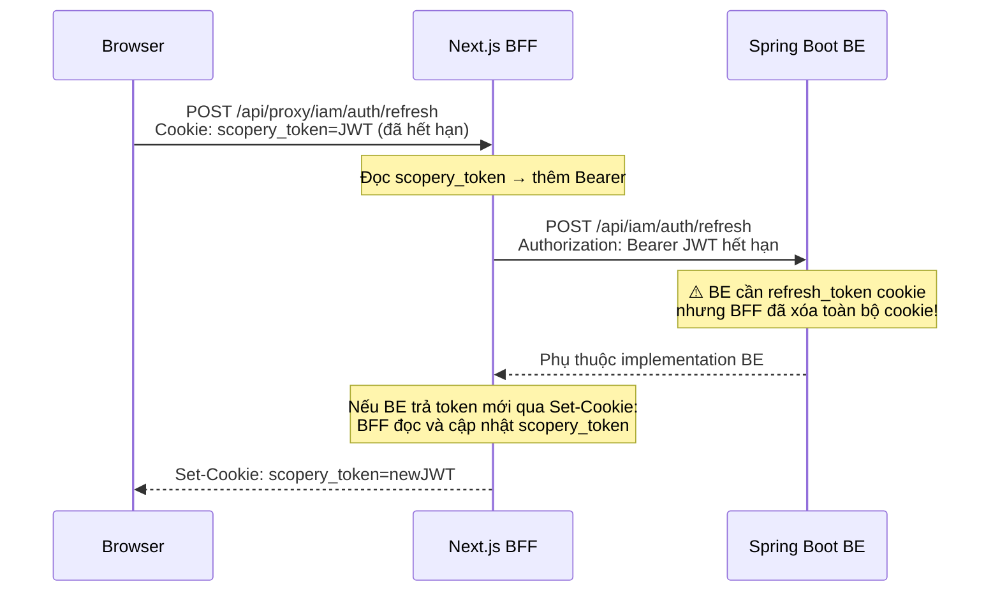
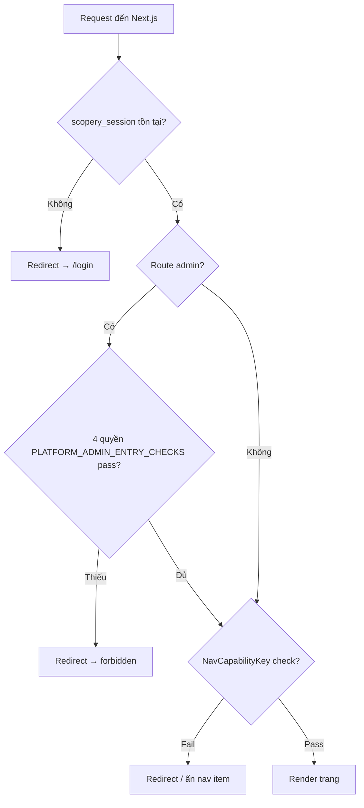
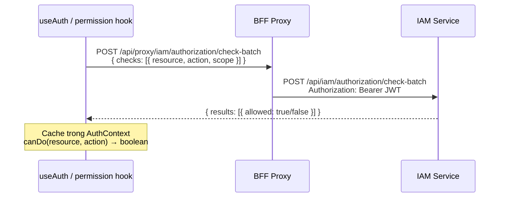
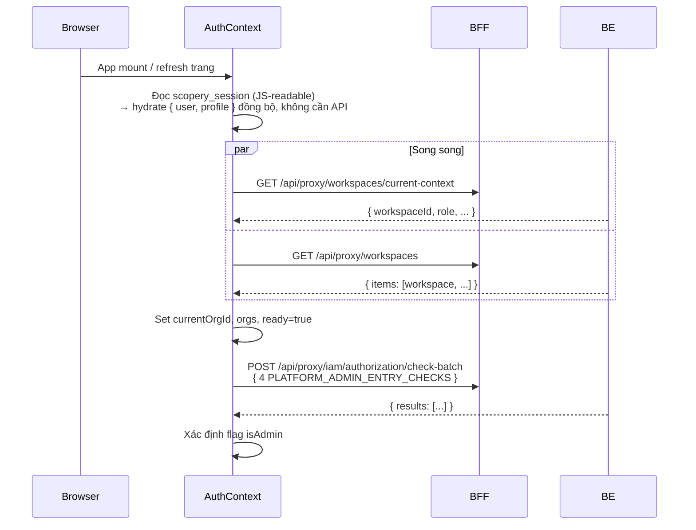

# Kiến trúc Xác thực — Scopery

> Bao gồm cả FE (Next.js) và BE (Spring Boot).  
> Cập nhật: 2026-08-27

---

## 1. Tổng quan Cookie

Scopery dùng cơ chế hai cookie: BFF proxy là component duy nhất được phép đặt và đọc cookie xác thực.

| Cookie | HttpOnly | Set bởi | Nội dung | Mục đích |
|---|---|---|---|---|
| `scopery_token` | ✅ | BFF (`/api/proxy/*`) | JWT thô (access token) | Browser tự gửi kèm mọi request đến BFF; BFF đọc và thêm vào `Authorization: Bearer` |
| `scopery_session` | ❌ (JS đọc được) | BFF (`/api/proxy/*`) | `{ user, profile }` JSON | FE dùng để bootstrap AuthContext mà không cần gọi API |
| `access_token` | ✅ | BE trực tiếp | JWT | Cookie gốc của BE; **bị BFF xóa** — không bao giờ đến browser |
| `refresh_token` | ✅ | BE trực tiếp | Refresh JWT | Cookie gốc của BE; **bị BFF xóa** — không bao giờ đến browser |

> **Gotcha quan trọng**: BE's `JwtAuthFilter` đọc cookie tên `access_token` (hardcode trong `CookieUtil.ACCESS_TOKEN_COOKIE`). FE lưu JWT dưới tên `scopery_token`. Hai tên này không bao giờ khớp — xác thực qua cookie chỉ hoạt động nếu browser gọi thẳng tới BE, điều Scopery không làm.

---

## 2. Luồng Đăng nhập

```mermaid
sequenceDiagram
    participant Browser
    participant BFF as Next.js BFF<br/>/api/proxy/[...path]
    participant BE as Spring Boot BE

    Browser->>BFF: POST /api/proxy/v2/auth/login<br/>{ email, password }
    BFF->>BE: POST /api/v2/auth/login<br/>(không có auth header, cookie bị xóa)
    BE-->>BFF: 200 OK { user, profile, ... }<br/>Set-Cookie: access_token=JWT; HttpOnly<br/>Set-Cookie: refresh_token=...; HttpOnly
    Note over BFF: Trích xuất JWT từ Set-Cookie<br/>của BE (access_token header)
    BFF-->>Browser: 200 OK { user, profile }<br/>Set-Cookie: scopery_token=JWT; HttpOnly<br/>Set-Cookie: scopery_session={user,profile}; SameSite=Lax
    Note over Browser: scopery_token lưu an toàn (httpOnly)<br/>scopery_session JS đọc được
    Browser->>Browser: AuthContext đọc scopery_session<br/>→ set user, profile, currentOrg
```

**Đăng xuất**: BFF xóa `scopery_token` và `scopery_session`; BE xóa `access_token` và `refresh_token`.

---

## 3. Hai Đường Gọi API (nguồn gốc của hầu hết lỗi 401)

### Đường A — BFF Proxy ✅ (đúng, dùng cho mọi call cần xác thực)

URL bắt đầu bằng `/api/proxy/`.



### Đường B — Next.js Rewrite ❌ (không có auth, dễ nhầm)

URL bắt đầu bằng `/api/` nhưng KHÔNG phải `/api/proxy/` hay `/api/auth/`.  
Khớp với rewrite rule trong `next.config.js` → forward server-to-server, không thêm Bearer.



> **Quy tắc**: `apiPath('/foo')` → rewrite (không auth). `/api/proxy/foo` → BFF (có Bearer).  
> Mọi call admin phải dùng `/api/proxy/`.

---

## 4. Luồng Refresh Token



> **Gap tiềm ẩn**: BFF xóa cookie trước khi forward nên BE không đọc được `refresh_token` qua proxy.  
> BE cần nhận refresh token qua request body hoặc custom header.

---

## 5. Bảo vệ Route FE (3 lớp)



| Lớp | Cơ chế | Vị trí |
|---|---|---|
| 1 — Middleware | Đọc `scopery_session`; không có → redirect `/login` | `middleware.ts` |
| 2 — Admin shell guard | Kiểm tra 4 quyền GLOBAL: `ViewUser`, `GovernanceView`, `ResourceView`, `ViewNotification` | `app/(admin)/layout.tsx` |
| 3 — NavCapabilityKey | Mỗi route workspace có 1 permission key riêng | `useNavCapability` hook |

---

## 6. Cơ chế Phân quyền Chi tiết



Permission dùng cấu trúc 3 phần:

```json
{ "resource": "SystemIamManagement", "action": "ViewUser", "scope": "GLOBAL" }
```

---

## 7. Bootstrap AuthContext Sau Đăng nhập / Refresh Trang



---

## 8. Knowledge API — Header Đặc biệt

Các call đến AI Assistant Knowledge Base cần header bổ sung do `knowledgeHeaders.ts` interceptor inject:

| Header | Nguồn | Mục đích |
|---|---|---|
| `X-Workspace-Id` | `currentOrgId` từ AuthContext | Phân tenant |
| `X-Actor-Id` | `profile.id` từ AuthContext | Audit / ACL subject |
| `X-Acl-Tokens` | ACL tokens của user | Kiểm soát truy cập tài nguyên |

Endpoints: `/api/proxy/v1/admin/ai-assistant/*`

---

## 9. Portal User Token

Scopery hỗ trợ **Client Portal** với loại token riêng:

```
JWT claim: principalType = "PORTAL"
→ Spring Security authority: ROLE_PORTAL_USER (không phải ROLE_USER)
→ Permission set riêng; không truy cập được route admin
```

Portal users xác thực qua endpoint riêng và nhận JWT scoped cho portal.

---

## 10. Các Điểm Cần Chú ý

| Vấn đề | Chi tiết |
|---|---|
| **Tên cookie không khớp** | FE dùng `scopery_token`; BE đọc cookie `access_token`. Xác thực qua cookie BE-native không hoạt động qua BFF proxy |
| **Hai pattern URL** | `/api/proxy/*` → có Bearer. `/api/*` → không có Bearer. Nhầm pattern → 401 kể cả super admin |
| **BFF xóa toàn bộ cookie** | `headers.delete('cookie')` trước khi forward — BE không bao giờ thấy `access_token` hay `refresh_token` qua proxy |
| **Google OAuth** | Chưa implement — throw error khi gọi |
| **`scopery_session` không httpOnly** | Cố ý để JS đọc được, dùng hydrate AuthContext đồng bộ không cần round-trip API |
| **Gap refresh token** | Endpoint refresh qua BFF không truyền được `refresh_token` cookie tới BE — BE cần hỗ trợ nhận qua body |
