# Business Requirements Document (BRD)

# Dynamic Work Operating System

**Version:** 1.0  
**Document Type:** Business Requirements Document + Functional Specification  
**Audience:** Product Owner, Business Analyst, System Analyst, UX/UI Designer, Solution Architect, Backend Engineer, Frontend Engineer, QA Engineer, Project Manager  
**Status:** Draft for review  
**Prepared for:** Dynamic Organization / Workspace / Application / Project / Document / IAM / AI Platform  
**Language:** English  

---

## Document Control

| Field | Value |
|---|---|
| Document Name | Dynamic Work Operating System BRD |
| Version | 1.0 |
| Status | Draft |
| Primary Owner | Product / BA Team |
| Reviewers | Product Owner, Engineering Lead, PM, QA, Security/IAM Owner |
| Target System Type | Multi-tenant work management, application lifecycle, document, AI and project commercial control platform |
| Delivery Style | DDD-friendly modular product; folder structure intentionally excluded |

---

## Table of Contents

1. [Executive Summary](#1-executive-summary)  
2. [Product Vision](#2-product-vision)  
3. [Business Goals](#3-business-goals)  
4. [Non-goals](#4-non-goals)  
5. [Personas and Stakeholders](#5-personas-and-stakeholders)  
6. [Scope Overview](#6-scope-overview)  
7. [High-level Product Concept](#7-high-level-product-concept)  
8. [Terminology and Glossary](#8-terminology-and-glossary)  
9. [Domain Model Overview](#9-domain-model-overview)  
10. [Resource Hierarchy](#10-resource-hierarchy)  
11. [Core Business Concepts](#11-core-business-concepts)  
12. [Capability Map](#12-capability-map)  
13. [Business Rules](#13-business-rules)  
14. [End-to-end Workflows](#14-end-to-end-workflows)  
15. [Functional Requirements](#15-functional-requirements)  
16. [Project Delivery Modes](#16-project-delivery-modes)  
17. [Project Commercials and Budget Control](#17-project-commercials-and-budget-control)  
18. [IAM and Policy Requirements](#18-iam-and-policy-requirements)  
19. [AI-assisted Lifecycle Requirements](#19-ai-assisted-lifecycle-requirements)  
20. [Document Hub Requirements](#20-document-hub-requirements)  
21. [Application Registry and Traceability](#21-application-registry-and-traceability)  
22. [Change Request and Release Management](#22-change-request-and-release-management)  
23. [Reporting and Analytics](#23-reporting-and-analytics)  
24. [Notifications, Events and Triggers](#24-notifications-events-and-triggers)  
25. [Audit and Compliance](#25-audit-and-compliance)  
26. [User Stories and Acceptance Criteria](#26-user-stories-and-acceptance-criteria)  
27. [Non-functional Requirements](#27-non-functional-requirements)  
28. [Constraints](#28-constraints)  
29. [Assumptions](#29-assumptions)  
30. [Data Model Proposal](#30-data-model-proposal)  
31. [API Capability Catalog](#31-api-capability-catalog)  
32. [Suggested Artifacts and Services to Add](#32-suggested-artifacts-and-services-to-add)  
33. [Migration Strategy](#33-migration-strategy)  
34. [Edge Cases and Exception Handling](#34-edge-cases-and-exception-handling)  
35. [Risks and Mitigations](#35-risks-and-mitigations)  
36. [Roadmap](#36-roadmap)  
37. [Decision Log](#37-decision-log)  
38. [Reference Notes](#38-reference-notes)  

---

# 1. Executive Summary

The proposed platform is a **Dynamic Work Operating System** that combines organization management, workspace management, application lifecycle mapping, project delivery management, document knowledge management, permission-aware IAM, AI-generated artifacts, and project commercial control.

The platform is not intended to be only a task tracker. It is intended to help an organization manage the complete lifecycle of work:

```text
Business context → Workspace → Application/Product map → Project → Work items → Release → Documentation → Financial control → Audit and traceability
```

The system should support users who need to:

- Create organizations and workspaces.
- Invite organization members.
- Create organization teams.
- Assign users or teams to workspaces and projects.
- Define applications/products/systems under workspaces.
- Model applications into modules, screens, APIs, flows, functional items and non-functional items.
- Create projects to deliver changes against one or more applications.
- Manage work items such as epics, stories, tasks, bugs, risks, decisions and change requests.
- Use delivery modes such as Predictive, Scrum, Kanban, Scrumban, Campaign and Custom.
- Track estimates, actual effort, resource rates, project budget, baseline cost, forecast cost and margin.
- Use AI to generate backlog, user stories, test cases, SRS, release notes and user guides.
- Enforce all sensitive actions through IAM policies and resource-action grants.
- Keep traceability from documents to requirements, functional items, work items, releases and generated documents.

The key design principle is:

> **Organization owns the business context. Workspace owns the execution context. Application owns the product structure. Project owns the delivery plan. Commercials own budget and forecast. IAM controls every action and every view of sensitive data. AI helps generate and analyze, but human review remains required.**

---

# 2. Product Vision

## 2.1 Vision Statement

Build a configurable enterprise work platform where organizations can manage their workspaces, applications, projects, documents, permissions, AI-generated artifacts and project financial control in one traceable system.

## 2.2 Product North Star

The platform should become a **permission-aware work and knowledge operating system** where every task, requirement, document, application function, project cost, release and AI-generated output can be traced back to its business context.

## 2.3 Strategic Product Positioning

The system should not be a direct copy of Jira, Notion, MS Project or Confluence. Instead, it should combine the strongest concepts:

| Product Pattern | Concept to Adopt |
|---|---|
| Jira | Issue/work item tracking, boards, sprints, workflows, releases |
| Notion | Document hub, dynamic properties, flexible knowledge structure |
| MS Project | Gantt, baseline, resource rate, cost, schedule tracking |
| Azure DevOps | Backlog, boards, delivery traceability, release concepts |
| Confluence | Document collaboration, knowledge management, product docs |
| Enterprise ALM | Requirement traceability, change management, auditability |
| PMO Tools | Budget, forecast, resource capacity, portfolio reporting |

---

# 3. Business Goals

## 3.1 Primary Goals

| Goal ID | Goal | Description |
|---|---|---|
| G-001 | Organization-first tenant model | Users join organizations before workspaces or projects. |
| G-002 | Dynamic workspace management | Organization owners can create multiple workspaces for different contexts. |
| G-003 | Application lifecycle mapping | Workspaces can define applications/products/systems and their functional structure. |
| G-004 | Flexible project delivery | Projects can use Predictive, Scrum, Kanban, Scrumban, Campaign or Custom mode. |
| G-005 | Dynamic work item model | Work item types are configurable instead of hard-coded as fixed enums. |
| G-006 | Permission-aware IAM | Every sensitive action must be checked by resource-action permissions. |
| G-007 | Policy-driven ownership | Resource creators receive rights from owner policies, not hard-coded owner roles. |
| G-008 | AI proposal-first lifecycle | AI can generate suggestions, but human review is required before committing changes. |
| G-009 | Document-driven delivery | Documents can drive requirements, backlog, change requests and generated guides. |
| G-010 | Project commercial control | PMs can compare planned cost, actual cost, forecast and margin. |
| G-011 | Traceability | System can trace from document → application function → work item → release → generated document. |
| G-012 | Auditability | Permission changes, commercial data access and AI actions must be auditable. |

## 3.2 Business Outcomes

The platform should help organizations:

- Reduce scattered work across documents, spreadsheets, tickets and chat.
- Improve project visibility and accountability.
- Give PMs better control over scope, schedule and cost.
- Give BAs and product teams a stable map of applications and functions.
- Generate better documentation after release.
- Improve permission safety in dynamic organizations.
- Support future AI use cases without exposing restricted data.

---

# 4. Non-goals

The following items are explicitly outside the initial scope unless later approved:

| Non-goal ID | Non-goal | Explanation |
|---|---|---|
| NG-001 | Full payroll system | The platform should not store salary as payroll truth. It should use cost rates for project costing. |
| NG-002 | Full ERP accounting | The platform can track project commercial estimates, actuals and forecasts but is not a GL/accounting system. |
| NG-003 | Automatic AI commit without approval | AI must not directly create final work items or documents without human review. |
| NG-004 | Hard-coded owner role authorization | Business logic must not depend on role names such as `Organization Owner`. |
| NG-005 | Single forced project methodology | Teams should not be forced into Scrum or Gantt only. The platform must support multiple delivery modes. |
| NG-006 | Public anonymous collaboration in MVP | Public links can be future scope due to security risk. |
| NG-007 | Complex payroll benefits/tax logic | Not part of project commercial control. |
| NG-008 | Fully automated critical path engine in MVP | Basic dependencies and Gantt can come first; advanced scheduling can be future phase. |

---

# 5. Personas and Stakeholders

## 5.1 System Owner / Platform Admin

System Owner manages global platform settings.

Responsibilities:

- Manage system-level resource types and actions.
- Manage system default role templates.
- Manage system default work item types and document types.
- Manage global IAM owner policies.
- Create or manage organizations when needed.
- Assign system-level permissions.

Pain points:

- Hard-coded roles make access hard to scale.
- Manual permission setup is error-prone.
- Need clear audit trail for system changes.

## 5.2 Organization Owner

Organization Owner manages one organization.

Responsibilities:

- Invite and manage organization members.
- Create workspaces.
- Create organization teams.
- Configure organization-level role templates and policies if allowed.
- Manage organization-level document and work item type catalogs.

Pain points:

- Needs control without depending on system admin for every change.
- Needs safe delegation to workspace/project managers.
- Needs visibility of workspace/project status.

## 5.3 Workspace Owner / Workspace Manager

Workspace Owner manages a workspace under an organization.

Responsibilities:

- Manage workspace access.
- Create applications and projects.
- Assign users/teams to workspace or projects.
- Manage workspace-level work item types if allowed.
- Monitor workspace-level portfolio, capacity and budget.

Pain points:

- Needs a clear view of all projects inside workspace.
- Needs to know which teams and users are overloaded.
- Needs consistent permissions across projects.

## 5.4 Project Manager / PM

PM manages delivery, timeline, resources and budget.

Responsibilities:

- Set project operating mode.
- Define project plan, milestones, dependencies or sprints.
- Assign resources.
- Manage estimates, baseline, actuals and forecasts.
- Monitor risks, issues, blockers and change requests.
- Prepare status reports and release readiness.

Pain points:

- Project tasks alone do not show profit/loss.
- Hard to compare planned vs actual effort.
- Hard to trace what application function a task changed.
- Hard to produce release documentation manually.

## 5.5 Product Owner / BA

Product Owner or BA owns requirement clarity and application function map.

Responsibilities:

- Define application modules, screens and functional items.
- Link documents to requirements and work items.
- Review AI-generated backlog and documents.
- Validate acceptance criteria.
- Track changes to functions over time.

Pain points:

- Requirements are scattered across documents and tickets.
- No stable map of application functionality.
- Manual SRS/user guide updates are time-consuming.

## 5.6 Developer / Engineer

Developers execute work items.

Responsibilities:

- Pick up tasks/stories/bugs.
- Log work if time tracking is enabled.
- Update status and technical notes.
- Link implementation to application functions when needed.

Pain points:

- Needs clear task context and acceptance criteria.
- Should not see sensitive budget/cost data unless authorized.

## 5.7 QA / Tester

QA validates functionality and regression scope.

Responsibilities:

- Create and execute test cases.
- Link tests to functional/non-functional items.
- Raise defects.
- Provide release quality evidence.

Pain points:

- Hard to know affected functions when change request happens.
- Test evidence often disconnected from project scope.

## 5.8 Finance / PMO User

Finance or PMO monitors commercial control.

Responsibilities:

- Manage rate cards if authorized.
- Review baseline, actual cost and forecast.
- Monitor margin and variance.
- Approve or review budget changes.

Pain points:

- Project data and cost data are disconnected.
- Actual hours may not reconcile with forecast.
- Sensitive cost data needs strict access control.

## 5.9 AI Agent User

Any authorized user using AI features.

Responsibilities:

- Trigger AI generation or analysis.
- Review AI outputs.
- Approve, edit or reject AI proposals.

Pain points:

- AI must not leak restricted documents or budget data.
- AI outputs must be traceable and reviewable.

---

# 6. Scope Overview

## 6.1 In Scope

The BRD covers the following capabilities:

1. Organization and workspace management.
2. Membership and team management.
3. IAM resource/action/grant/policy model.
4. Application Registry for product/system/function mapping.
5. Project management with multiple operating modes.
6. Work item management with dynamic types and fields.
7. Document Hub and document lifecycle.
8. AI proposal-first generation lifecycle.
9. Change request and impact analysis.
10. Release management and generated documentation.
11. Project budget, rates, baseline, timesheets and actual cost.
12. Gantt, sprint, Kanban, retrospective and campaign workflows.
13. Reporting, audit, notification and traceability.

## 6.2 Out of Scope for MVP but Included as Future Roadmap

- Public document sharing.
- Advanced portfolio optimization.
- Full earned schedule implementation.
- Integration with payroll/ERP accounting.
- Marketplace-style plugin ecosystem.
- Advanced capacity simulation and AI-based scheduling optimizer.
- Cross-organization project sharing.

---

# 7. High-level Product Concept

## 7.1 Conceptual Layers

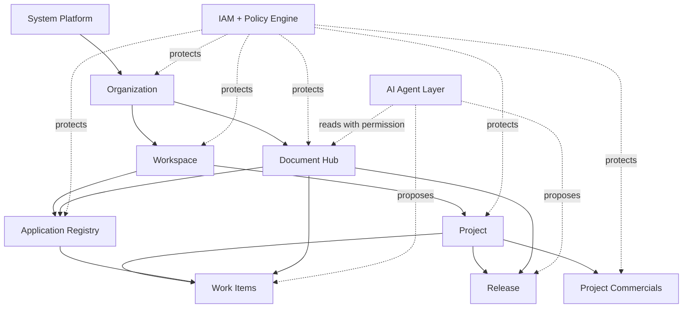

## 7.2 Product Principle

Every major entity should be treated as a resource if it requires access control, audit, ownership, sharing, AI access or lifecycle management.

---

# 8. Terminology and Glossary

| Term | Meaning |
|---|---|
| System | The global platform level above all organizations. |
| Organization | A company/client/tenant-level business container. |
| Workspace | A working context inside an organization, used to group applications and projects. |
| Team | A group of organization members; team belongs to organization and can be assigned to workspace/project. |
| Application | A product/system/app/solution being built or maintained. |
| Application Registry | The workspace-level catalog of applications and their structures. |
| Application Structure Node | A configurable tree node such as module, sub-module, screen, API, flow or custom level. |
| Functional Item | A traceable function/capability that an application provides. |
| Non-functional Item | A quality/constraint requirement such as performance, security or auditability. |
| Project | A delivery effort used to implement, change, fix or release work. |
| Work Item | A trackable delivery item such as epic, story, task, bug, risk, decision or change request. |
| Delivery Mode | The operating style of a project: Predictive, Scrum, Kanban, Scrumban, Campaign, Custom. |
| Document Hub | Organization-level knowledge base that stores documents, versions and generated documents. |
| Resource | A protected object in IAM. |
| Action | A specific operation on a resource. |
| Grant | The actual permission record allowing or denying a principal to perform actions. |
| Role Template | A reusable bundle of actions used to assign permissions faster. |
| Owner Policy | Policy that defines what rights are automatically granted to the creator/owner of a resource. |
| Delegation Policy | Policy that controls whether a user can grant rights to another principal. |
| Inheritance Policy | Policy that controls whether rights on a parent resource apply to child resources. |
| AI Proposal | AI-generated draft output that must be reviewed before being committed. |
| Baseline | Approved snapshot of scope, schedule and cost used for variance comparison. |
| Actual Work | Approved work/time already performed. |
| Actual Cost | Cost incurred for work already performed or non-labor expenses. |
| Forecast Cost | Estimated total project cost based on actual cost plus remaining work. |
| Margin | Revenue or contract value minus project cost. |
| Release | A packaged delivery milestone containing functions, work items, documents, fixes and approvals. |
| Traceability | Linkage across documents, requirements, application items, work items, tests, releases and changes. |

---

# 9. Domain Model Overview

## 9.1 High-level Domain Map

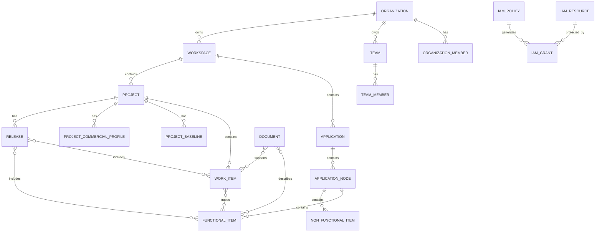

## 9.2 Important Domain Decisions

| Decision | Rationale |
|---|---|
| Organization is the tenant/business container. | A user must belong to an organization before accessing its workspace/project resources. |
| Team belongs to organization, not workspace. | Teams can be reused across many workspaces/projects. |
| Workspace is execution context, not tenant. | Workspace groups projects and applications under organization. |
| Application is separate from project. | Application is long-lived; project is a delivery effort. |
| Work item types are configurable. | System should support custom delivery item types. |
| Document Hub is organization-level. | Documents may link to workspaces/projects but belong to organization knowledge base. |
| IAM checks actions, not role names. | Dynamic role templates should not leak into business logic. |
| AI output is proposal-first. | Human review protects quality and prevents unauthorized automatic changes. |
| Budget is rate-based. | Project commercial control should not depend on raw payroll data. |

---

# 10. Resource Hierarchy

## 10.1 Target Resource Tree

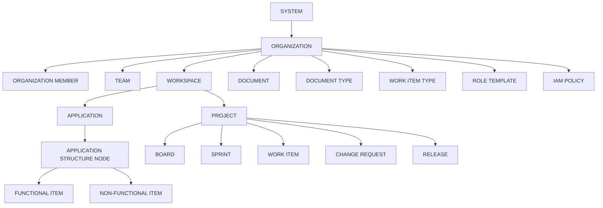

## 10.2 Resource Protection Rule

A resource must be registered in IAM if any of the following is true:

- It has an owner.
- It can be shared.
- It has view/update/delete restrictions.
- It can be used by AI.
- It contains sensitive commercial, document or identity data.
- It requires audit history.
- It participates in permission inheritance.

---

# 11. Core Business Concepts

## 11.1 System

System is the top-level platform boundary. It is not the same as an application being built by an organization.

System can manage:

- Global resource types.
- Global action catalog.
- Global owner policies.
- Global role templates.
- System default work item types.
- System default document types.
- Organization creation permissions.

## 11.2 Organization

Organization represents the company/client/tenant.

Examples:

```text
Organization: Archetype Group
Organization: Client Company A
Organization: Testing Organization
```

Organization owns:

- Members.
- Teams.
- Workspaces.
- Organization document hub.
- Organization-level configuration.
- Organization-level role templates and policies.

## 11.3 Workspace

Workspace represents an execution context inside organization.

Examples:

```text
Workspace: Internal Tools
Workspace: Client Delivery
Workspace: Spring Air Program
Workspace: ERP Transformation
```

Workspace contains:

- Applications.
- Projects.
- Workspace-level access.
- Workspace-level dashboards.
- Workspace-level delivery settings.

## 11.4 Application

Application is the product/system/app/solution being built or maintained.

Examples:

```text
Application: Employee Portal
Application: Budget Tool
Application: Candidate Portal
Application: ABC Mobile App
Application: CRM Integration Service
```

Application contains:

- Modules.
- Screens.
- APIs.
- Flows.
- Functional items.
- Non-functional items.
- Links to work items, documents, releases and changes.

## 11.5 Project

Project is a delivery effort.

Examples:

```text
Project: Employee Portal Phase 1
Project: Candidate Portal UAT Fixes
Project: Budget Tool CCH Fix
Project: CRM Integration Rollout
```

Project contains:

- Work items.
- Delivery mode.
- Plans, boards, sprints or campaign calendar.
- Budget and commercial profile.
- Baseline.
- Release scope.
- AI proposals.
- Change requests.

## 11.6 Work Item

Work Item is a unit of delivery work.

Default types:

- Epic.
- Story.
- Task.
- Sub-task.
- Bug.
- Change Request.
- Requirement.
- Risk.
- Decision.

Custom types can be created based on permission.

## 11.7 Document

Document is a knowledge artifact in Document Hub.

Examples:

- BRD.
- PRD.
- SRS.
- Technical Specification.
- Test Case.
- Meeting Notes.
- User Guide.
- Release Notes.
- Policy.

## 11.8 Commercial Control

Commercial Control is the capability that lets PMs and authorized users track:

- Estimate.
- Resource cost rate.
- Planned labor cost.
- Actual labor cost.
- Non-labor cost.
- Baseline.
- Forecast cost at completion.
- Contract value.
- Margin.
- Cost/schedule variance.

---

# 12. Capability Map

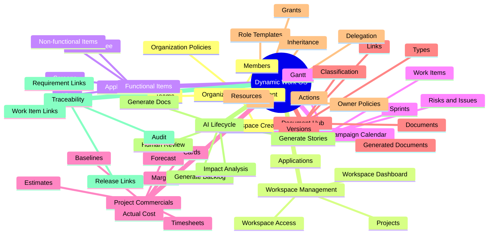

---

# 13. Business Rules

## 13.1 Organization and Membership Rules

| Rule ID | Rule | Explanation |
|---|---|---|
| BR-ORG-001 | User must join organization before accessing workspace/project. | Workspace/project access must not be granted to a non-member. |
| BR-ORG-002 | Organization creator receives rights from Organization Owner Policy. | Creator rights are policy-driven, not hard-coded. |
| BR-ORG-003 | Removing a user from organization suspends inherited access. | Organization membership is parent boundary. |
| BR-ORG-004 | Organization can have multiple workspaces. | Workspaces represent separate execution contexts. |
| BR-ORG-005 | Organization owner can create team if granted action. | Ownership alone is not enough; action grant must exist. |

## 13.2 Team Rules

| Rule ID | Rule | Explanation |
|---|---|---|
| BR-TEAM-001 | Team belongs to organization. | Team is reusable across workspaces/projects. |
| BR-TEAM-002 | Team members must be organization members. | No external team members unless guest model is introduced. |
| BR-TEAM-003 | Team grants are inherited by active team members. | User gains access through team membership. |
| BR-TEAM-004 | Removing user from team removes team-inherited access. | Direct grants remain unaffected. |
| BR-TEAM-005 | Team cannot be assigned across organization boundary. | Prevents cross-tenant access leak. |

## 13.3 Workspace Rules

| Rule ID | Rule | Explanation |
|---|---|---|
| BR-WS-001 | Workspace must belong to one organization. | Workspace is not global. |
| BR-WS-002 | Workspace creator receives rights from Workspace Owner Policy. | Rights are configurable. |
| BR-WS-003 | Workspace access can be granted to user or team. | Supports direct and group access. |
| BR-WS-004 | Workspace can contain multiple applications and projects. | Workspace is a broad work context. |
| BR-WS-005 | Workspace access does not automatically grant all project actions unless inheritance policy allows. | Permission inheritance must be explicit. |

## 13.4 Application Registry Rules

| Rule ID | Rule | Explanation |
|---|---|---|
| BR-APP-001 | Application must belong to one workspace. | Application is managed in execution context. |
| BR-APP-002 | Application is long-lived; project is time-bound. | Project delivers changes; application stores product map. |
| BR-APP-003 | Application structure levels must be configurable. | User can define module/screen/API/flow/custom nodes. |
| BR-APP-004 | Functional items should link to work items and documents. | Enables traceability. |
| BR-APP-005 | Non-functional items can apply across modules/screens/projects. | NFRs often cut across functions. |

## 13.5 Project Rules

| Rule ID | Rule | Explanation |
|---|---|---|
| BR-PROJ-001 | Project must belong to one workspace. | Project is scoped under workspace. |
| BR-PROJ-002 | Project can link to one or more applications if allowed. | Some projects affect multiple systems. |
| BR-PROJ-003 | Project must have one operating mode. | Mode controls enabled screens, validations and metrics. |
| BR-PROJ-004 | Project creator receives rights from Project Owner Policy. | Owner rights are policy-driven. |
| BR-PROJ-005 | Project can have commercial profile if enabled. | Internal non-commercial projects may disable revenue/margin view. |

## 13.6 Work Item Rules

| Rule ID | Rule | Explanation |
|---|---|---|
| BR-WI-001 | Work item belongs to project. | Project is the delivery container. |
| BR-WI-002 | Work item type must be enabled for the project. | Disabled/custom types cannot be selected. |
| BR-WI-003 | Work item can link to functional and non-functional items. | Supports application traceability. |
| BR-WI-004 | Work item can have estimate and actuals. | Supports commercial reporting. |
| BR-WI-005 | Work item cannot be deleted if audit policy requires preservation. | Use archive instead. |
| BR-WI-006 | Parent-child hierarchy must follow configured type rules. | Example: Epic → Story → Task/Sub-task. |

## 13.7 Commercial Rules

| Rule ID | Rule | Explanation |
|---|---|---|
| BR-COM-001 | Project cost uses resource rates, not payroll salary. | Protects sensitive HR data. |
| BR-COM-002 | Resource rates must be effective-dated. | Historical actual cost must remain correct after rate changes. |
| BR-COM-003 | Baseline must be approved before official variance reporting. | Baseline is the budget/schedule comparison anchor. |
| BR-COM-004 | Actual labor cost uses approved actual work only. | Draft/unapproved time should not affect official commercial reports. |
| BR-COM-005 | Rebaseline requires explicit permission. | Prevents silent budget reset. |
| BR-COM-006 | Cost and margin data require separate permissions. | Commercial data is sensitive. |
| BR-COM-007 | Forecast cost equals actual cost plus remaining forecast cost. | Enables EAC/margin projection. |
| BR-COM-008 | Non-labor cost must be tracked separately from labor cost. | Vendor/expense cost should not be hidden in time logs. |

## 13.8 IAM Rules

| Rule ID | Rule | Explanation |
|---|---|---|
| BR-IAM-001 | Backend checks actions, not role names. | Role is only a bundle; grant is truth. |
| BR-IAM-002 | Every protected resource must be registered. | Enables consistent access decision. |
| BR-IAM-003 | Owner rights come from Owner Policy. | Avoids hard-coded owner behavior. |
| BR-IAM-004 | Actor can only delegate rights they have. | Prevents privilege escalation. |
| BR-IAM-005 | Actor cannot delegate broader scope than own scope. | Prevents boundary breach. |
| BR-IAM-006 | DENY overrides ALLOW. | Safety-first permission resolution. |
| BR-IAM-007 | Default decision is deny. | If no matching grant, access is denied. |
| BR-IAM-008 | AI acts on behalf of requesting user. | AI must not bypass IAM. |

## 13.9 AI Rules

| Rule ID | Rule | Explanation |
|---|---|---|
| BR-AI-001 | AI output must be proposal-first. | Human review before commit. |
| BR-AI-002 | AI can only read resources actor can access. | Prevents data leakage. |
| BR-AI-003 | AI output must keep source references. | Required for traceability. |
| BR-AI-004 | AI-generated work items must be marked. | Transparency and auditability. |
| BR-AI-005 | Commercial AI summaries must respect commercial permissions. | AI must not reveal hidden costs. |

## 13.10 Document Rules

| Rule ID | Rule | Explanation |
|---|---|---|
| BR-DOC-001 | Document belongs to organization. | Document Hub is organization-level. |
| BR-DOC-002 | New document is private by default. | Safe default. |
| BR-DOC-003 | Document type is metadata, not permission. | Permission comes from IAM/classification. |
| BR-DOC-004 | Classification can restrict sharing. | Security policy. |
| BR-DOC-005 | Document version must be preserved after release generation. | Keeps historical output. |

---

# 14. End-to-end Workflows

## 14.1 New User Creates Organization and Default Workspace

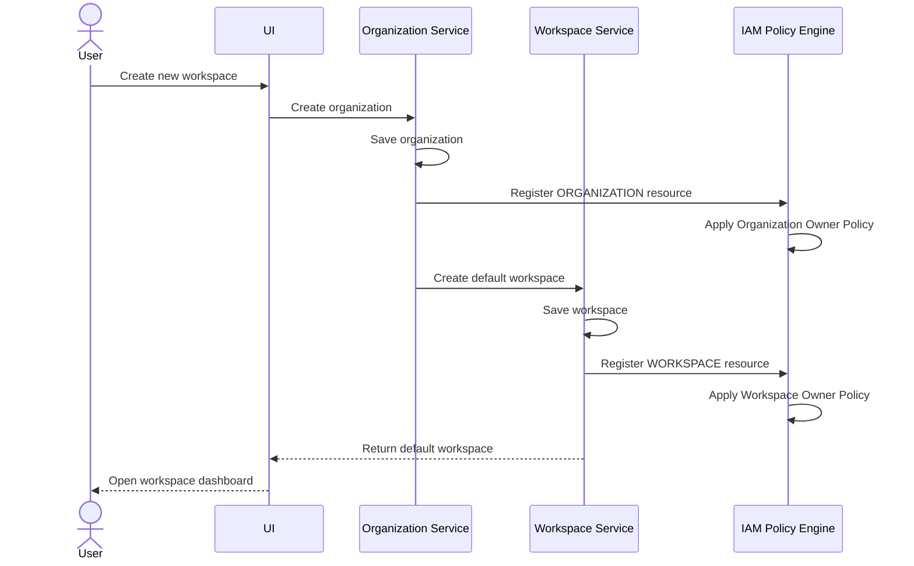

## 14.2 Existing User Joins Organization

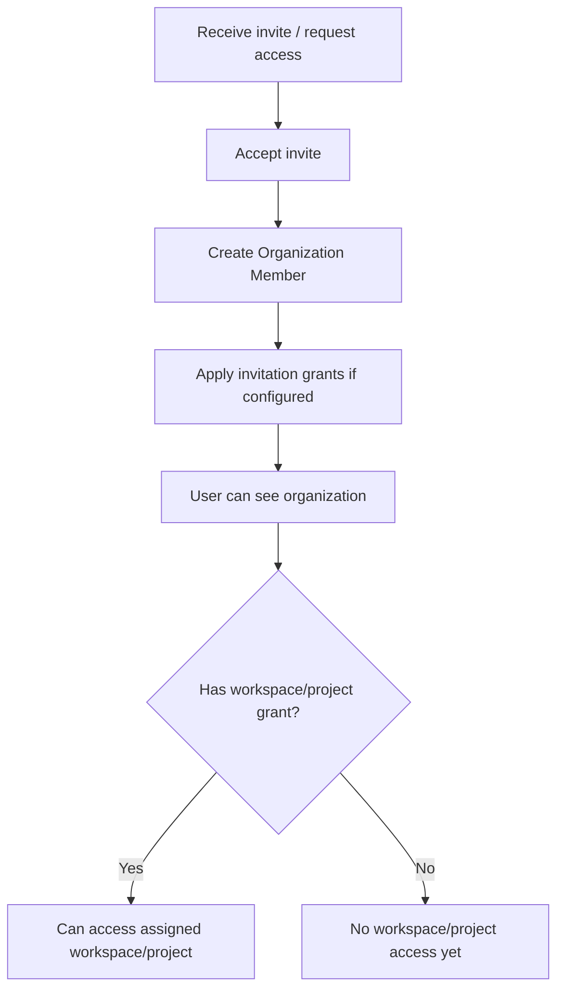

## 14.3 Create Application and Functional Map

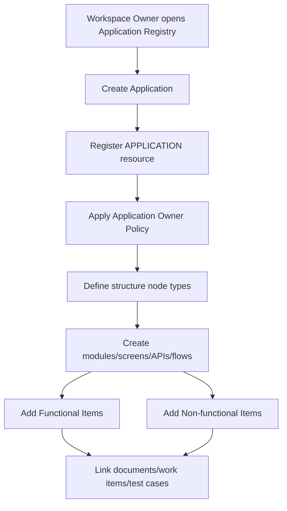

## 14.4 Create Project with Delivery Mode and Budget

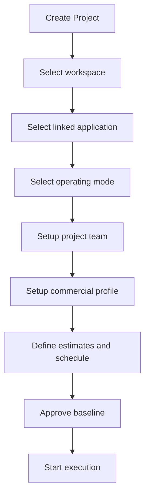

## 14.5 Work Item Execution and Cost Roll-up

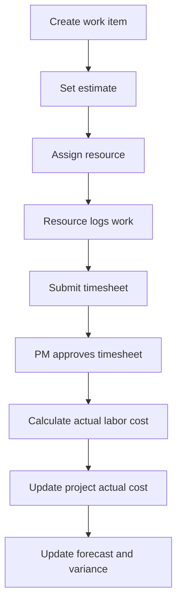

## 14.6 AI Backlog Generation

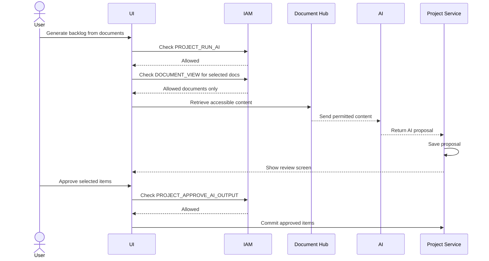

## 14.7 Release Documentation Generation

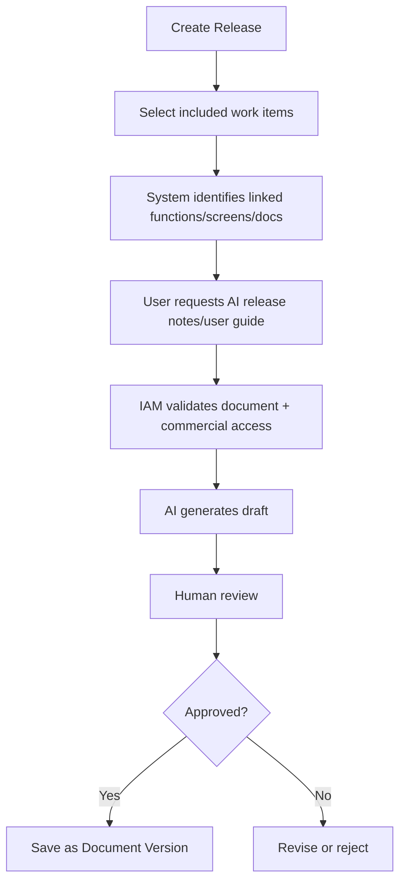

---

# 15. Functional Requirements

## 15.1 Organization Management

### FR-ORG-001 — Create Organization

The system shall allow an authorized user to create an organization.

Required behavior:

- Create organization record.
- Add creator as organization member.
- Register organization as IAM resource.
- Apply active Organization Owner Policy to creator.
- Create audit log.

### FR-ORG-002 — Manage Organization Members

The system shall allow authorized users to invite, activate, deactivate and remove organization members.

### FR-ORG-003 — Organization Member Boundary

The system shall prevent adding non-organization users to workspace, team or project unless the user is first invited to organization.

### FR-ORG-004 — Organization Settings

The system shall allow authorized users to manage organization-level settings:

- Work item type catalog.
- Document type catalog.
- Role templates.
- Owner policies if allowed.
- Default workspace creation behavior.

## 15.2 Team Management

### FR-TEAM-001 — Create Team

Authorized organization users can create teams.

### FR-TEAM-002 — Manage Team Members

Authorized users can add/remove organization members to/from team.

### FR-TEAM-003 — Assign Team to Workspace or Project

Authorized users can grant access to a team for workspace/project resources.

### FR-TEAM-004 — Inherited Team Access

The system shall calculate access inherited from team grants.

## 15.3 Workspace Management

### FR-WS-001 — Create Workspace

Authorized organization users can create a workspace under organization.

### FR-WS-002 — Workspace Access Management

Authorized users can grant/revoke workspace access for organization members or teams.

### FR-WS-003 — Workspace Dashboard

Workspace dashboard shall show:

- Applications.
- Projects.
- Teams assigned.
- Project health.
- Budget summary if authorized.
- Recent documents.
- AI suggestions if enabled.

## 15.4 Application Registry

### FR-APP-001 — Create Application

Authorized users can create application/product/system assets under workspace.

### FR-APP-002 — Manage Application Structure

Authorized users can create a dynamic structure tree.

Supported default node types:

- Module.
- Sub-module.
- Screen.
- API.
- Flow.
- Report.
- Integration Point.
- Data Area.
- Permission Area.
- Custom.

### FR-APP-003 — Manage Functional Items

Authorized users can create functional items under application nodes.

Functional item should support:

- Title.
- Description.
- Actor.
- Business value.
- Expected behavior.
- Acceptance criteria.
- Priority.
- Status.
- Estimate.
- Owner.
- Source document.
- Linked work items.

### FR-APP-004 — Manage Non-functional Items

Authorized users can create NFRs under application, module, screen or project scope.

NFR categories:

- Performance.
- Security.
- Scalability.
- Availability.
- Accessibility.
- Usability.
- Compliance.
- Auditability.
- Maintainability.
- Observability.
- Data retention.
- Backup/recovery.

### FR-APP-005 — Application Traceability

The system shall display all linked work items, documents, tests, changes and releases from application structure level down to function level.

## 15.5 Project Management

### FR-PROJ-001 — Create Project

Authorized users can create projects under workspace.

Required setup fields:

- Project name.
- Project code.
- Workspace.
- Linked application(s).
- Operating mode.
- Project owner/PM.
- Start date.
- Target end date.
- Commercial profile if enabled.

### FR-PROJ-002 — Project Operating Mode

Project shall support operating modes:

- Predictive.
- Scrum.
- Kanban.
- Scrumban.
- Campaign.
- Custom.

### FR-PROJ-003 — Project Members and Roles

Authorized users can assign users/teams to project and grant project-level actions.

### FR-PROJ-004 — Project Health

Project dashboard shall show:

- Scope status.
- Schedule status.
- Budget status if authorized.
- Risk/issue status.
- Sprint/flow status depending on mode.
- Release readiness.
- Recent changes.

## 15.6 Work Item Management

### FR-WI-001 — Manage Work Item Types

System shall seed default work item types but allow authorized customization by level.

Levels:

- System.
- Organization.
- Workspace.
- Project.

### FR-WI-002 — Create Work Item

Authorized users can create work items using enabled work item types.

### FR-WI-003 — Work Item Dynamic Fields

System shall support custom fields configured by work item type or project.

Field types:

- Text.
- Number.
- Date.
- Select.
- Multi-select.
- Boolean.
- User.
- Team.
- URL.
- Attachment.
- Relation.
- Formula.

### FR-WI-004 — Work Item Links

Work item can link to:

- Parent/child work item.
- Related work item.
- Blocker/dependency.
- Functional item.
- Non-functional item.
- Document.
- Test case.
- Change request.
- Release.

### FR-WI-005 — Work Item Time Tracking

Work item shall support:

- Original estimate.
- Remaining estimate.
- Actual spent.
- Work logs.
- Timesheet linkage.

## 15.7 Document Hub

### FR-DOC-001 — Create Document

Authorized users can create documents in organization document hub.

Default visibility: Private.

### FR-DOC-002 — Document Versioning

System shall preserve document versions.

### FR-DOC-003 — Document Linking

Document can link to organization, workspace, project, application, functional item, work item, release or change request.

### FR-DOC-004 — Document Type and Classification

Document shall support:

- Type.
- Tags.
- Classification.
- Status.

### FR-DOC-005 — Generated Documents

AI-generated documents must be saved as draft/proposal before final approval.

## 15.8 Project Commercials

### FR-COM-001 — Rate Card Management

Authorized users can manage effective-dated cost rates and optional billable rates.

### FR-COM-002 — Project Commercial Profile

Project can define commercial model:

- Internal.
- Fixed fee.
- Time and materials.
- Retainer.
- Custom.

### FR-COM-003 — Baseline Management

Authorized users can create and approve project baseline.

Baseline captures:

- Planned scope.
- Planned start/end.
- Planned hours.
- Planned labor cost.
- Planned non-labor cost.
- Planned total cost.
- Planned revenue/contract value.
- Planned margin.

### FR-COM-004 — Actual Cost Calculation

System calculates actual labor cost from approved actual work and effective cost rate.

### FR-COM-005 — Forecast and Margin

System calculates:

- Actual cost to date.
- Remaining forecast cost.
- Estimate at completion.
- Variance at completion.
- Forecast margin.

### FR-COM-006 — Commercial Data Permission

Commercial data requires explicit permissions separate from general project view.

## 15.9 AI Lifecycle

### FR-AI-001 — Generate Backlog

Authorized users can ask AI to generate backlog from selected accessible documents.

### FR-AI-002 — Generate User Stories

AI can propose user stories from functional items, requirements or documents.

### FR-AI-003 — Generate Acceptance Criteria

AI can propose acceptance criteria for functional items or work items.

### FR-AI-004 — Generate Test Cases

AI can generate test case drafts based on functional items and acceptance criteria.

### FR-AI-005 — Impact Analysis

AI can compare document versions or change requests and propose impacted functions/work items/tests/docs.

### FR-AI-006 — Generate Release Documents

AI can generate release notes, user guide, SRS delta, training material or handover docs from release scope.

---

# 16. Project Delivery Modes

## 16.1 Predictive Mode

Predictive mode is suitable for planned delivery, fixed scope, migration, enterprise rollout and client implementation projects.

Features:

- Task tree.
- Gantt chart.
- Start/end dates.
- Dependencies.
- Lead/lag.
- Milestones.
- Baseline schedule.
- Critical path in advanced phase.
- Schedule variance.

Business rules:

- Milestone can have zero duration or explicit milestone flag.
- Dependency changes can affect forecast finish date.
- Baseline schedule must remain preserved after approval.

## 16.2 Scrum Mode

Scrum mode is suitable for product teams using sprints.

Features:

- Product backlog.
- Sprint planning.
- Sprint backlog.
- Sprint goal.
- Definition of Done.
- Daily progress view.
- Sprint review.
- Sprint retrospective.
- Burndown/burnup.
- Velocity.
- Capacity.

Business rules:

- Sprint must have start and end date.
- Sprint should have sprint goal.
- Completed work should meet Definition of Done.
- Retro action items can become work items.

## 16.3 Kanban Mode

Kanban mode is suitable for support, maintenance, operations and continuous flow teams.

Features:

- Board columns.
- WIP limits.
- Aging cards.
- Blockers.
- Cycle time.
- Lead time.
- Throughput.
- Cumulative flow diagram.

Business rules:

- WIP limit can warn or block based on policy.
- Kanban does not require sprint.
- Work can be reprioritized continuously.

## 16.4 Scrumban Mode

Scrumban combines sprint cadence and Kanban flow controls.

Features:

- Period planning.
- Optional sprint goal.
- WIP limits.
- Flow metrics.
- Retrospective cadence.
- Mid-period intake policy.

Business rules:

- Scrumban can allow controlled intake during active period.
- WIP limits remain applicable.
- Retro actions can feed next planning cycle.

## 16.5 Campaign Mode

Campaign mode is suitable for marketing, launch, event, content or rollout campaigns.

Features:

- Campaign calendar.
- Milestones.
- Channels.
- Assets.
- Owners.
- Launch readiness.
- KPI targets.
- Campaign budget.
- Post-launch review.

Business rules:

- Campaign project prioritizes timeline/calendar views.
- Campaign can link to application release if product launch is involved.
- Campaign KPI tracking is optional but recommended.

## 16.6 Custom Mode

Custom mode allows organization/workspace to configure custom workflows, screens and metrics.

Business rules:

- Custom mode must still use core IAM, audit and work item rules.
- Custom mode cannot bypass resource/action permissions.

---

# 17. Project Commercials and Budget Control

## 17.1 Purpose

Project Commercials provides PMs and authorized stakeholders with visibility of planned cost, actual cost, remaining effort, forecast cost, budget variance and profitability.

## 17.2 Costing Principle

The system should use **cost rates** rather than raw salary.

Reason:

- Salary is sensitive HR/payroll data.
- PMs need cost per hour/day for project control, not full compensation detail.
- Rates can be anonymized, role-based or user-specific based on policy.

## 17.3 Cost Profile

Cost profile stores rates used for calculations.

Fields:

| Field | Description |
|---|---|
| profileId | Unique profile ID |
| organizationId | Organization owning profile |
| resourceType | USER, ROLE, TEAM or GENERIC_RESOURCE |
| resourceId | Linked resource |
| internalCostRate | Internal cost per hour/day |
| overtimeCostRate | Optional overtime rate |
| billableRate | Optional client billable rate |
| currency | Currency code |
| effectiveFrom | Start effective date |
| effectiveTo | End effective date |
| visibilityLevel | Who can view rate |
| status | Active/inactive |

## 17.4 Project Commercial Profile

Fields:

| Field | Description |
|---|---|
| commercialModel | INTERNAL, FIXED_FEE, TIME_AND_MATERIALS, RETAINER, CUSTOM |
| contractValue | Approved revenue/contract value |
| currency | Revenue/cost currency |
| plannedNonLaborBudget | Non-labor planned cost |
| contingencyBudget | Budget reserve |
| billingPolicy | Optional billing configuration |
| marginTarget | Target margin percentage |
| approvalStatus | Draft/approved/rejected |

## 17.5 Core Calculations

### Planned Labor Cost

```text
Planned Labor Cost = Σ(estimated hours × planned cost rate)
```

### Actual Labor Cost

```text
Actual Labor Cost = Σ(approved actual hours × effective cost rate at work date)
```

### Remaining Labor Cost

```text
Remaining Labor Cost = Σ(remaining estimate × effective cost rate)
```

### Forecast Cost at Completion

```text
Forecast Cost at Completion = Actual Cost + Remaining Forecast Cost
```

### Gross Margin

```text
Gross Margin = Contract Value - Forecast Cost at Completion
Gross Margin % = Gross Margin / Contract Value × 100
```

### Cost Variance

```text
Cost Variance = Baseline Cost - Actual/Forecast Cost
```

### Earned Value Metrics (Advanced)

```text
PV = Planned Value
EV = Earned Value
AC = Actual Cost
CV = EV - AC
SV = EV - PV
CPI = EV / AC
SPI = EV / PV
EAC = Actual Cost + Estimate To Complete
VAC = Budget At Completion - Estimate At Completion
```

## 17.6 Baseline Lifecycle

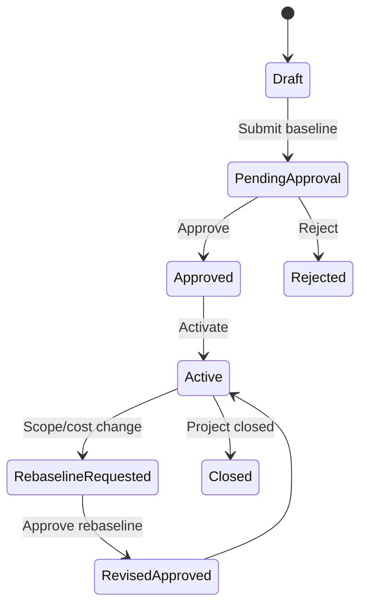

## 17.7 Timesheet Lifecycle

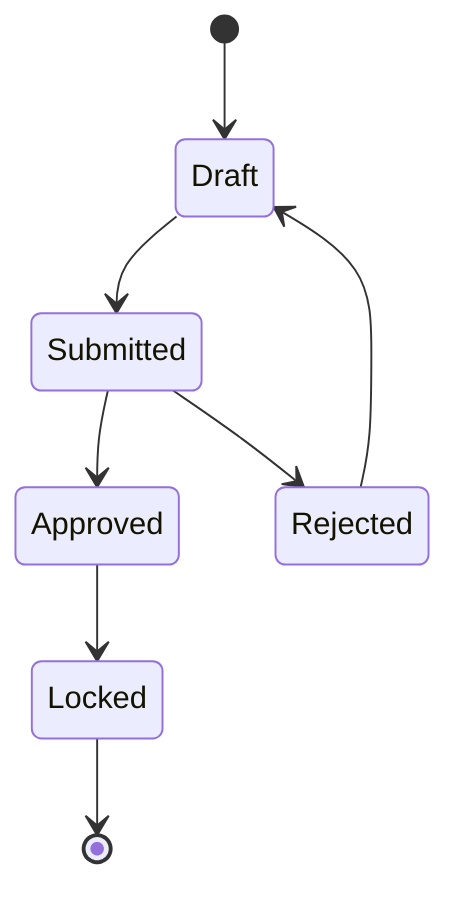

## 17.8 Commercial Permissions

Commercial data must be protected separately.

Actions:

- PROJECT_VIEW_COMMERCIALS
- PROJECT_MANAGE_COMMERCIAL_PROFILE
- PROJECT_MANAGE_BASELINE
- PROJECT_APPROVE_BASELINE
- PROJECT_MANAGE_RATE_CARD
- PROJECT_VIEW_RESOURCE_COST_RATE
- PROJECT_SUBMIT_TIMESHEET
- PROJECT_APPROVE_TIMESHEET
- PROJECT_VIEW_ACTUAL_COST
- PROJECT_VIEW_MARGIN
- PROJECT_EXPORT_COMMERCIAL_REPORT
- PROJECT_REBASELINE

---

# 18. IAM and Policy Requirements

## 18.1 IAM Principle

IAM is the central policy and authorization engine. Business modules should not implement their own role-name checks.

The core authorization question is:

```text
Can principal P perform action A on resource R within scope S?
```

## 18.2 Core IAM Concepts

| Concept | Description |
|---|---|
| Resource | Protected object such as organization, workspace, project, document. |
| Action | Operation such as view, update, invite, create project, run AI. |
| Principal | User, team, role assignment or system actor. |
| Grant | Actual allow/deny permission record. |
| Role Template | Reusable action bundle. |
| Owner Policy | Generates owner grants when resource is created. |
| Delegation Policy | Controls whether actor can grant rights to others. |
| Inheritance Policy | Controls parent-child permission inheritance. |
| Condition | Optional rule such as time-bound or classification-bound access. |

## 18.3 IAM Decision Flow

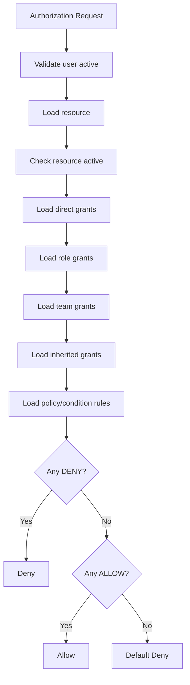

## 18.4 Owner Policy

Owner Policy defines what the creator receives when a resource is created.

Example:

| Resource Type | Policy | Default Rights |
|---|---|---|
| ORGANIZATION | Organization Owner Policy | View, update, invite member, create team, create workspace, manage role, grant permission |
| WORKSPACE | Workspace Owner Policy | View, update, assign user/team, create project, manage application, grant permission |
| PROJECT | Project Owner Policy | View, update, manage work item, manage board/sprint, run AI, manage baseline, grant permission |
| DOCUMENT | Document Owner Policy | View, update, share, link, version, manage metadata |
| APPLICATION | Application Owner Policy | View, update, manage structure, manage functional items, generate docs |

## 18.5 Delegation Policy

Delegation policy must check:

1. Actor has grant permission on the resource.
2. Actor has the same action being delegated.
3. Actor's grant has `canDelegate = true`.
4. Actor does not delegate broader scope than own grant.
5. Actor does not cross organization boundary.
6. Delegation is audited.

## 18.6 Inheritance Policy

Scope modes:

| Scope Mode | Meaning |
|---|---|
| SELF_ONLY | Only the specific resource. |
| DESCENDANTS | Resource and child resources based on hierarchy. |
| SPECIFIC_CHILDREN | Only selected child resources. |
| ORGANIZATION_WIDE | All resources in organization where policy allows. |
| CUSTOM | Custom condition-based scope. |

## 18.7 AI Access Policy

AI must act as the requesting user.

Rules:

- AI can only read documents user can view.
- AI can only summarize commercial data user can view.
- AI cannot generate committed records without approval.
- AI execution logs must include source resources and permission context.

---

# 19. AI-assisted Lifecycle Requirements

## 19.1 AI Proposal-first Pattern

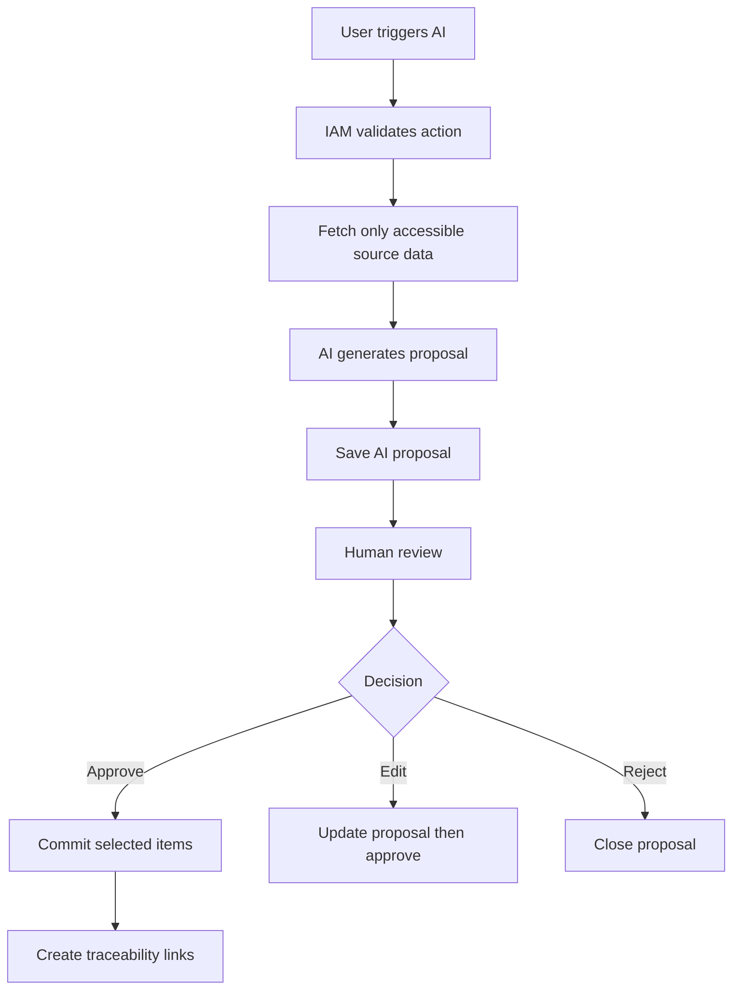

## 19.2 AI Proposal Types

| Proposal Type | Output |
|---|---|
| BACKLOG_GENERATION | Epics, stories, tasks |
| USER_STORY_GENERATION | Story candidates and acceptance criteria |
| TEST_CASE_GENERATION | Test scenario and test case drafts |
| IMPACT_ANALYSIS | Impacted functions/work items/documents/tests |
| CHANGE_REQUEST_GENERATION | Change request proposal |
| RELEASE_NOTE_GENERATION | Release note draft |
| USER_GUIDE_GENERATION | User guide draft |
| SRS_GENERATION | SRS or SRS delta |
| PM_STATUS_GENERATION | Project status report draft |
| BUDGET_RISK_SUMMARY | Budget/schedule risk summary for authorized users |

## 19.3 AI Safety Requirements

- AI prompt must include only authorized data.
- AI response must be stored with model, prompt version, source IDs and actor ID.
- AI output must show confidence and source reference where possible.
- AI-generated content must be editable before approval.
- AI-generated records must be marked as AI-generated.

---

# 20. Document Hub Requirements

## 20.1 Document Visibility

| Visibility | Description |
|---|---|
| PRIVATE | Owner and explicitly granted users only. |
| ORGANIZATION | Organization members with document view rights. |
| WORKSPACE | Users/teams with workspace access and document view rights. |
| PROJECT | Users/teams with project access and document view rights. |
| TEAM | Specific team-based access. |
| RESTRICTED | Explicit grants only. |

## 20.2 Document Type vs Tag vs Classification

| Concept | Purpose | Controls Permission? |
|---|---|---|
| Document Type | Business type: BRD, SRS, User Guide | No |
| Tag | Flexible label: MVP, Phase 1, Client Request | No |
| Classification | Sensitivity: Internal, Confidential, HR Confidential | Yes, may restrict sharing |

## 20.3 Generated Documents

Generated documents should have lifecycle:

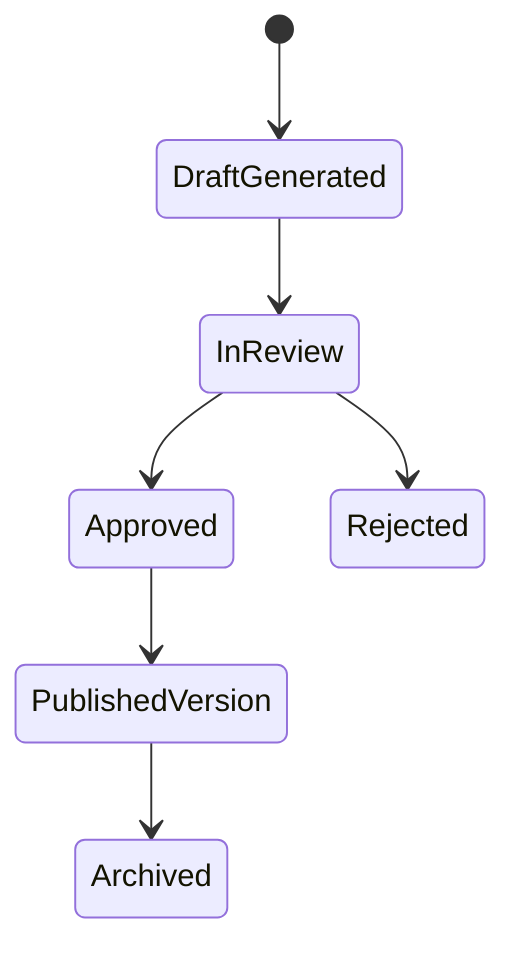

---

# 21. Application Registry and Traceability

## 21.1 Purpose

Application Registry provides a long-lived map of what a system/application contains.

It answers:

- What modules exist?
- What screens/APIs/flows exist?
- What functions are supported?
- What NFRs apply?
- Which tasks implemented or changed this function?
- Which bugs affected this function?
- Which release shipped it?
- Which documents describe it?
- How much was estimated vs actually spent?

## 21.2 Suggested Application Tree

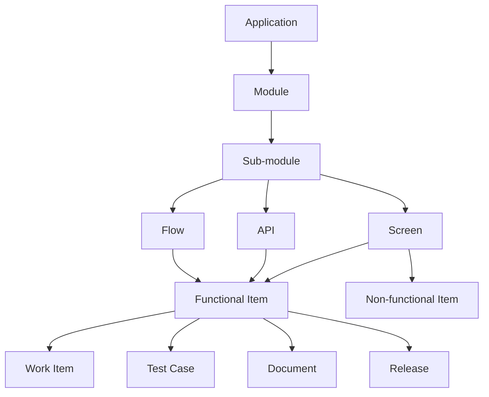

## 21.3 Functional Item Lifecycle

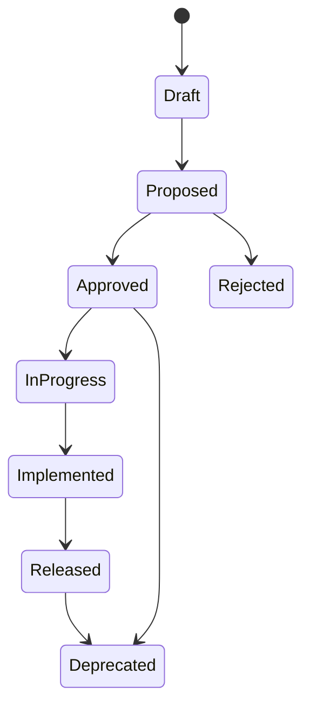

## 21.4 Traceability Matrix

| Source | Target | Link Type |
|---|---|---|
| Document | Functional Item | DESCRIBES |
| Functional Item | Work Item | IMPLEMENTED_BY |
| Functional Item | Bug | AFFECTED_BY |
| Functional Item | Change Request | CHANGED_BY |
| Functional Item | Test Case | TESTED_BY |
| Functional Item | Release | RELEASED_IN |
| Release | Document | DOCUMENTED_BY |
| Change Request | Work Item | CREATES_OR_UPDATES |

---

# 22. Change Request and Release Management

## 22.1 Change Request Lifecycle

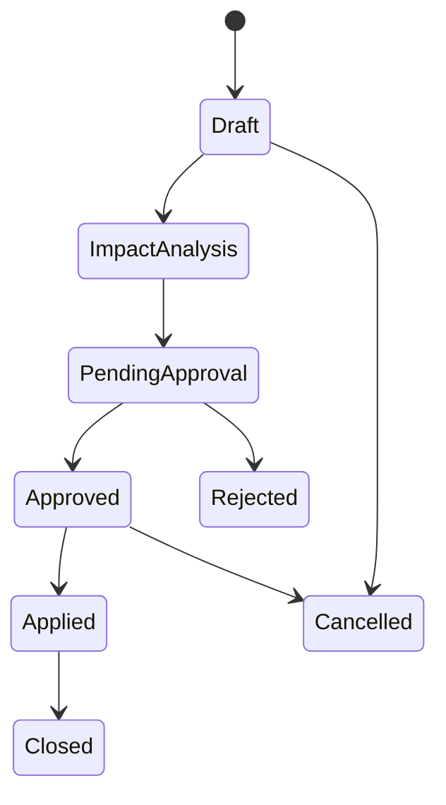

## 22.2 Change Request Sources

- User-created.
- Document update.
- AI-detected change.
- Client request.
- Scope change.
- Bug escalation.
- Release feedback.
- Retrospective action.

## 22.3 Release Lifecycle

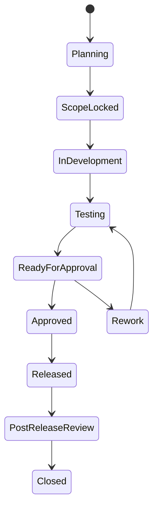

## 22.4 Release Readiness Checklist

A release can be marked ready only when policy-required conditions are met:

- Required work items completed.
- Critical bugs resolved or waived.
- Required tests executed.
- Required documents reviewed.
- Required approvals completed.
- Commercial approval completed if release affects budget/revenue.
- Rollback plan attached if required.

---

# 23. Reporting and Analytics

## 23.1 Workspace PMO Dashboard

Should show:

- Project status by workspace.
- Project budget status.
- Forecast margin summary.
- Overdue milestones.
- Resource allocation/capacity.
- Open risks/issues.
- Active releases.
- AI-generated insights.

## 23.2 Project Dashboard

Should show:

- Scope summary.
- Work item progress.
- Schedule status.
- Budget status if authorized.
- Delivery mode metrics.
- Risks/issues/blockers.
- Release readiness.
- Recent changes.

## 23.3 Commercial Dashboard

Should show:

- Baseline cost.
- Planned cost.
- Actual cost.
- Remaining cost.
- Forecast cost at completion.
- Contract value.
- Forecast margin.
- Cost variance.
- Schedule variance.
- CPI/SPI if advanced metrics enabled.

## 23.4 Scrum Reports

- Sprint burndown.
- Sprint burnup.
- Velocity.
- Sprint capacity.
- Completed vs committed.
- Retro action completion.

## 23.5 Kanban Reports

- Cycle time.
- Lead time.
- Throughput.
- WIP.
- Aging cards.
- Blocked work.
- Cumulative flow.

## 23.6 Application Traceability Reports

- Function to work item coverage.
- Function to test coverage.
- Function to document coverage.
- Function to release history.
- Module/screen change history.
- Estimate vs actual by function/module/application.

---

# 24. Notifications, Events and Triggers

## 24.1 Event and Trigger Matrix

| Event | Trigger | Target Users | Notification / Action |
|---|---|---|---|
| OrganizationCreated | Organization created | Creator, system admins | Confirmation, audit |
| OrganizationMemberInvited | Invite sent | Invitee | Email/in-app invite |
| OrganizationMemberRemoved | Member removed | Security/admins | Revoke inherited access |
| TeamMemberAdded | User added to team | User, team owner | Access may be inherited |
| WorkspaceCreated | Workspace created | Creator, org owner | Owner policy applied |
| WorkspaceAccessGranted | User/team assigned | Grantee | Access notification |
| ApplicationCreated | Application created | App owner | Owner policy applied |
| FunctionalItemCreated | Function added | Watchers | Traceability update |
| ProjectCreated | Project created | PM, project members | Project available |
| ProjectBaselineSubmitted | Baseline submitted | Approvers | Approval required |
| ProjectBaselineApproved | Baseline approved | PM, finance/PMO | Official baseline active |
| TimesheetSubmitted | User submits hours | PM/approver | Approval required |
| TimesheetApproved | Hours approved | PM/finance | Actual cost recalculated |
| WorkItemBlocked | Item marked blocked | Assignee, PM | Blocker alert |
| SprintStarted | Sprint begins | Scrum team | Sprint notification |
| SprintClosed | Sprint closed | Team, stakeholders | Review/retro prompts |
| RetroActionCreated | Action item created | Owner | Follow-up action |
| ChangeRequestSubmitted | CR submitted | Approvers | Approval required |
| AIProposalCreated | AI proposal saved | Requester/reviewers | Review required |
| AIProposalApproved | Proposal approved | PM/team | Committed records created |
| ReleaseReadyForApproval | Release checklist complete | Approvers | Approval required |
| ReleaseApproved | Release approved | Project members | Release can proceed |
| DocumentGenerated | AI draft generated | Reviewers | Review required |

## 24.2 Event Processing Rules

- Security-critical resource registration should run in same transaction where possible.
- Notification can run asynchronously.
- Audit log must be written for permission, commercial and approval actions.
- AI event execution must store prompt version and source references.

---

# 25. Audit and Compliance

## 25.1 Audit Scope

The system must audit:

- Login and security-sensitive events.
- Resource creation/archiving.
- Permission grants/revokes.
- Owner policy changes.
- Role template changes.
- Rate card changes.
- Baseline approval/rebaseline.
- Timesheet approval.
- Actual cost manual adjustment.
- AI proposal generation/approval.
- Document classification changes.
- Release approval.

## 25.2 Audit Fields

| Field | Description |
|---|---|
| auditId | Unique ID |
| actorId | User/system actor |
| action | Performed action |
| resourceType | Resource type |
| resourceId | Resource ID |
| beforeSnapshot | Optional before state |
| afterSnapshot | Optional after state |
| reason | Optional user-provided reason |
| timestamp | Event time |
| ipAddress | Optional security field |
| userAgent | Optional security field |
| correlationId | Request correlation ID |

---

# 26. User Stories and Acceptance Criteria

## 26.1 Organization Onboarding

### US-ORG-001 — Create Organization and Workspace

As a new user, I want to create a workspace that automatically creates an organization, so that I can start using the platform without manually configuring tenant structure.

Acceptance criteria:

```gherkin
Given a new user has no organization
When the user creates a new workspace
Then the system creates an organization
And adds the user as organization member
And creates the default workspace
And registers both organization and workspace as IAM resources
And applies owner policies to the creator
```

```gherkin
Given organization creation succeeds
When workspace creation fails
Then the system must not leave the user with an inaccessible organization
And the transaction must rollback or recover to a consistent state
```

## 26.2 Organization Membership

### US-ORG-002 — Invite Organization Member

As an organization owner, I want to invite users to my organization, so that I can assign them to teams, workspaces and projects.

Acceptance criteria:

```gherkin
Given the actor has ORGANIZATION_INVITE_MEMBER
When the actor invites a user by email
Then the system creates an invitation
And sends an invite notification
And the invited user can accept the invitation
```

```gherkin
Given a user is not an organization member
When an actor tries to assign the user to a workspace
Then the system rejects the assignment
And shows that the user must join the organization first
```

## 26.3 Team Management

### US-TEAM-001 — Create Organization Team

As an organization owner, I want to create teams under the organization, so that I can manage group access consistently.

Acceptance criteria:

```gherkin
Given the actor has ORGANIZATION_CREATE_TEAM
When the actor creates a team
Then the team is created under the organization
And the team is registered as an IAM resource
And team owner policy is applied if configured
```

## 26.4 Workspace Access

### US-WS-001 — Assign Team to Workspace

As a workspace owner, I want to assign an organization team to a workspace, so that all team members can access the workspace.

Acceptance criteria:

```gherkin
Given a team belongs to the same organization as the workspace
And the actor has WORKSPACE_ASSIGN_TEAM
When the actor assigns the team to the workspace
Then all active team members inherit the configured workspace access
And the grant is recorded in IAM
And the action is audited
```

## 26.5 Application Registry

### US-APP-001 — Create Application

As a workspace owner, I want to create an application under a workspace, so that I can manage the product/system being delivered.

Acceptance criteria:

```gherkin
Given the actor has APPLICATION_CREATE on the workspace
When the actor creates an application
Then the application is created under the workspace
And registered as an IAM resource
And application owner policy is applied to the creator
```

### US-APP-002 — Define Application Structure

As a BA, I want to define modules, screens and APIs under an application, so that the project team can trace work to product structure.

Acceptance criteria:

```gherkin
Given an application exists
And the actor has APPLICATION_MANAGE_STRUCTURE
When the actor creates a structure node
Then the node is added under the selected parent
And the application tree displays the node in the configured order
```

```gherkin
Given the organization has custom node types
When the actor creates a structure node
Then the custom node type can be selected
And the system does not restrict the structure to hard-coded levels only
```

### US-APP-003 — Create Functional Item

As a BA, I want to create a functional item under a screen or module, so that implementation work can be traced to business functionality.

Acceptance criteria:

```gherkin
Given an application node exists
And the actor has APPLICATION_MANAGE_FUNCTIONAL_ITEM
When the actor creates a functional item
Then the item is saved under the selected node
And can be linked to work items, documents, tests, releases and change requests
```

## 26.6 Project Creation

### US-PROJ-001 — Create Project

As a workspace owner, I want to create a project under a workspace, so that a delivery effort can be managed.

Acceptance criteria:

```gherkin
Given the actor has WORKSPACE_CREATE_PROJECT
When the actor creates a project
Then the project is created under the selected workspace
And the project is registered as an IAM resource
And project owner policy is applied to the creator
```

### US-PROJ-002 — Select Operating Mode

As a PM, I want to select a project operating mode, so that the project provides the correct planning screens and metrics.

Acceptance criteria:

```gherkin
Given a project is being created
When the PM selects Scrum mode
Then the system enables backlog, sprint planning, sprint board, burndown and retrospective views
And disables predictive-only required fields unless configured otherwise
```

```gherkin
Given a project is being created
When the PM selects Predictive mode
Then the system enables Gantt, milestones, dependencies and baseline schedule views
```

## 26.7 Work Item Management

### US-WI-001 — Create Work Item

As a project member, I want to create a work item, so that project work can be tracked.

Acceptance criteria:

```gherkin
Given the actor has PROJECT_CREATE_WORK_ITEM
And the selected work item type is enabled for the project
When the actor creates a work item
Then the work item is created
And appears in project backlog or board based on project mode
```

### US-WI-002 — Link Work Item to Functional Item

As a BA or PM, I want to link a work item to a functional item, so that I can trace implementation work back to application functionality.

Acceptance criteria:

```gherkin
Given a functional item exists
And a work item exists in a linked project
When the actor links the work item to the functional item
Then the relationship is saved
And the functional item traceability view shows the work item
```

## 26.8 Scrum Mode

### US-SCRUM-001 — Create Sprint

As a Scrum PM or Product Owner, I want to create a sprint, so that the team can plan work in a fixed iteration.

Acceptance criteria:

```gherkin
Given a project is in Scrum mode
And the actor has PROJECT_MANAGE_SPRINT
When the actor creates a sprint
Then the sprint has name, start date, end date and optional sprint goal
And backlog items can be selected into the sprint
```

### US-SCRUM-002 — Sprint Retrospective

As a Scrum team, I want to record retrospective feedback and action items, so that improvement work is not lost.

Acceptance criteria:

```gherkin
Given a sprint is closed or ready to close
When the team creates retrospective notes
Then the system records what went well, what did not go well, and action items
And action items can be promoted to work items
```

## 26.9 Kanban Mode

### US-KANBAN-001 — Apply WIP Limit

As a Kanban team, I want WIP limits on board columns, so that we can prevent overload.

Acceptance criteria:

```gherkin
Given a board column has WIP limit of 3
And the current column already has 3 active work items
When a user moves another item into the column
Then the system warns or blocks the move based on board policy
```

## 26.10 Predictive Mode

### US-GANTT-001 — Manage Gantt Schedule

As a PM, I want to manage tasks, dates, milestones and dependencies in a Gantt view, so that I can control schedule.

Acceptance criteria:

```gherkin
Given a project is in Predictive mode
When the PM creates tasks with start/end dates and dependencies
Then the Gantt view displays the task timeline
And milestone tasks are visually identified
And dependency changes update the forecast schedule when scheduling rules are enabled
```

## 26.11 Campaign Mode

### US-CAMP-001 — Manage Campaign Calendar

As a campaign manager, I want to manage milestones, channels, assets and KPI targets, so that campaign execution can be tracked.

Acceptance criteria:

```gherkin
Given a project is in Campaign mode
When the campaign manager opens the planning view
Then the default view is a timeline/calendar
And the project supports campaign milestones, channels, assets, owners, budget and KPI targets
```

## 26.12 Project Commercials

### US-COM-001 — Manage Resource Rates

As a finance or PMO user, I want to manage resource cost rates, so that project costs can be calculated.

Acceptance criteria:

```gherkin
Given the actor has PROJECT_MANAGE_RATE_CARD
When the actor creates a cost profile with effective dates
Then the rate is used for project cost calculations only within the effective date range
```

### US-COM-002 — Approve Baseline

As a PM or approver, I want to approve project baseline, so that planned cost and schedule can be compared against actuals.

Acceptance criteria:

```gherkin
Given a project has planned scope, estimates, assignments and cost profile
When an authorized approver approves the baseline
Then the system stores a baseline snapshot
And locks baseline values for variance reporting
```

### US-COM-003 — Calculate Actual Labor Cost

As a PM, I want approved work logs to calculate actual labor cost, so that project actual cost is accurate.

Acceptance criteria:

```gherkin
Given a user logs 8 hours on a project task
And the timesheet is approved
When the cost engine recalculates actuals
Then actual labor cost is calculated using the user's effective cost rate on the work date
And unapproved hours are excluded from official actual cost
```

### US-COM-004 — View Project Margin

As a PM or finance user, I want to see forecast project margin, so that I can know if the project is profitable.

Acceptance criteria:

```gherkin
Given a project has contract value and forecast cost at completion
And the actor has PROJECT_VIEW_MARGIN
When the actor opens commercial dashboard
Then the system displays forecast margin amount and margin percentage
```

```gherkin
Given a user can view project work but lacks PROJECT_VIEW_MARGIN
When the user opens commercial dashboard
Then margin and cost rate information are hidden
```

## 26.13 AI Proposal

### US-AI-001 — Generate Backlog from Document

As a BA, I want AI to generate backlog from selected documents, so that I can reduce manual analysis effort.

Acceptance criteria:

```gherkin
Given the actor has PROJECT_RUN_AI
And the actor has DOCUMENT_VIEW on selected documents
When the actor runs backlog generation
Then AI generates a proposal containing epics, stories and tasks
And no work item is committed until approval
```

### US-AI-002 — Approve AI Proposal

As a PM or BA, I want to approve selected AI proposal items, so that only reviewed items become real work items.

Acceptance criteria:

```gherkin
Given an AI proposal exists
And the actor has PROJECT_APPROVE_AI_OUTPUT
When the actor approves selected proposal items
Then the system creates corresponding work items
And links them to source documents and proposal items
```

## 26.14 Document Hub

### US-DOC-001 — Create Private Document

As a user, I want new documents to be private by default, so that my drafts are safe until I share them.

Acceptance criteria:

```gherkin
Given a user creates a new document
When the document is saved
Then the document visibility is Private
And only the owner or explicitly granted users can view it
```

### US-DOC-002 — Generate User Guide from Release

As a BA, I want AI to generate a user guide from release scope, so that post-release documentation is faster.

Acceptance criteria:

```gherkin
Given a release has approved functional items and completed work items
And the actor has APPLICATION_GENERATE_DOCUMENT
When the actor requests user guide generation
Then AI creates a draft document
And the document must be reviewed before becoming an approved document version
```

---

# 27. Non-functional Requirements

## 27.1 Security

| NFR ID | Requirement |
|---|---|
| NFR-SEC-001 | All protected actions must pass IAM authorization. |
| NFR-SEC-002 | Default access decision must be deny. |
| NFR-SEC-003 | Sensitive commercial data must require separate permissions. |
| NFR-SEC-004 | AI must not receive unauthorized resource content. |
| NFR-SEC-005 | Permission grants, rate changes and baseline approvals must be audited. |
| NFR-SEC-006 | Private documents must not be visible to organization owner unless explicit policy allows. |

## 27.2 Performance

| NFR ID | Requirement |
|---|---|
| NFR-PERF-001 | Common dashboard queries should load within acceptable UX threshold. |
| NFR-PERF-002 | Authorization decision should be optimized and cacheable where safe. |
| NFR-PERF-003 | Large boards and Gantt views should support pagination/virtualization. |
| NFR-PERF-004 | AI generation must run asynchronously for long-running tasks. |

## 27.3 Scalability

| NFR ID | Requirement |
|---|---|
| NFR-SCALE-001 | One organization can have many workspaces. |
| NFR-SCALE-002 | One workspace can have many applications and projects. |
| NFR-SCALE-003 | One project can have thousands of work items. |
| NFR-SCALE-004 | Permission model must support user, team, role and policy grants. |

## 27.4 Reliability

| NFR ID | Requirement |
|---|---|
| NFR-REL-001 | Resource creation and IAM registration must be consistent. |
| NFR-REL-002 | Critical financial calculations must be reproducible. |
| NFR-REL-003 | Effective-dated rates must preserve historical actual cost. |
| NFR-REL-004 | AI failures must not break primary project workflows. |

## 27.5 Maintainability

| NFR ID | Requirement |
|---|---|
| NFR-MAINT-001 | Business modules should call IAM through stable authorization/provisioning contracts. |
| NFR-MAINT-002 | Role names must not be used in business authorization conditions. |
| NFR-MAINT-003 | Configurable catalogs should use data-driven records. |
| NFR-MAINT-004 | Feature flags should support phased rollout. |

## 27.6 Auditability

| NFR ID | Requirement |
|---|---|
| NFR-AUD-001 | Audit logs must preserve actor, action, resource, timestamp and context. |
| NFR-AUD-002 | Audit logs must be immutable for security-sensitive operations. |
| NFR-AUD-003 | AI proposals must keep source references and approval history. |

---

# 28. Constraints

| Constraint ID | Constraint | Impact |
|---|---|---|
| CON-001 | System must remain DDD-friendly. | IAM should be centralized but accessed through stable contracts. |
| CON-002 | Folder structure is intentionally not defined in this BRD. | Engineering team decides implementation layout. |
| CON-003 | Raw salary should not be required for project costing. | Use cost profiles/rates. |
| CON-004 | AI cannot bypass IAM. | All AI sources must be permission-filtered. |
| CON-005 | Organization is required before workspace/project access. | Migration required from workspace-first model. |
| CON-006 | Policy changes must not silently break existing grants. | Need migration/versioning strategy. |
| CON-007 | Baseline must be preserved after approval. | Rebaseline must create new version, not overwrite original. |

---

# 29. Assumptions

| Assumption ID | Assumption |
|---|---|
| ASM-001 | Each user has a global identity but can belong to multiple organizations. |
| ASM-002 | One organization can contain multiple workspaces. |
| ASM-003 | Team belongs to organization and can be assigned to many workspaces/projects. |
| ASM-004 | Workspace must exist before creating project. |
| ASM-005 | Application belongs to workspace and can be linked to projects. |
| ASM-006 | Document belongs to organization but can be linked to workspace/project/application/work item. |
| ASM-007 | Cost rates are managed separately from payroll salary. |
| ASM-008 | AI provider/model configuration exists or will exist separately. |
| ASM-009 | Users may need multiple project methodologies within the same platform. |
| ASM-010 | Some organizations may disable commercial features for internal or lightweight projects. |

---

# 30. Data Model Proposal

This section describes proposed data concepts only. It does not prescribe implementation folder structure.

## 30.1 Organization and Workspace

```text
organization
- id
- name
- code
- status
- createdBy
- createdAt

organization_member
- id
- organizationId
- userId
- status
- joinedAt

team
- id
- organizationId
- name
- code
- status

team_member
- id
- teamId
- userId
- status

workspace
- id
- organizationId
- name
- code
- status
- createdBy
```

## 30.2 Application Registry

```text
application
- id
- organizationId
- workspaceId
- name
- code
- description
- ownerUserId
- status
- lifecycleStage

application_node_type
- id
- ownerLevel
- ownerResourceId
- code
- name
- isSystemDefault
- status

application_structure_node
- id
- applicationId
- parentNodeId
- nodeTypeId
- name
- code
- description
- displayOrder
- status

functional_item
- id
- applicationId
- nodeId
- title
- description
- actor
- businessValue
- expectedBehavior
- priority
- status
- initialEstimate
- estimateUnit
- ownerUserId

non_functional_item
- id
- applicationId
- nodeId
- category
- title
- description
- targetMetric
- verificationMethod
- priority
- status
```

## 30.3 Project and Work Item

```text
project
- id
- organizationId
- workspaceId
- name
- code
- operatingMode
- status
- startDate
- targetEndDate
- ownerUserId

project_application_link
- id
- projectId
- applicationId
- linkType

work_item_type
- id
- ownerLevel
- ownerResourceId
- code
- name
- description
- isSystemDefault
- status

work_item
- id
- projectId
- typeId
- parentWorkItemId
- title
- description
- status
- priority
- assigneeUserId
- reporterUserId
- originalEstimate
- remainingEstimate
- actualSpent
- estimateUnit

work_item_link
- id
- sourceWorkItemId
- targetType
- targetId
- linkType
```

## 30.4 Commercials

```text
resource_cost_profile
- id
- organizationId
- resourceType
- resourceId
- internalCostRate
- overtimeCostRate
- billableRate
- currency
- effectiveFrom
- effectiveTo
- status

project_commercial_profile
- id
- projectId
- commercialModel
- contractValue
- currency
- plannedNonLaborBudget
- contingencyBudget
- marginTarget
- status

project_baseline
- id
- projectId
- version
- plannedStartDate
- plannedEndDate
- plannedLaborHours
- plannedLaborCost
- plannedNonLaborCost
- plannedTotalCost
- plannedRevenue
- plannedMargin
- approvedBy
- approvedAt
- status

timesheet_entry
- id
- userId
- projectId
- workItemId
- workDate
- hours
- status
- submittedAt
- approvedBy
- approvedAt

actual_cost_entry
- id
- projectId
- sourceType
- sourceId
- costCategory
- amount
- currency
- costDate
```

## 30.5 IAM

```text
iam_resource
- id
- resourceType
- resourceId
- parentResourceType
- parentResourceId
- organizationId
- ownerUserId
- status
- visibility

iam_action
- id
- resourceType
- actionCode
- name
- description
- status

iam_grant
- id
- principalType
- principalId
- resourceType
- resourceId
- actionCode
- effect
- scopeMode
- grantKind
- sourcePolicyId
- canDelegate
- delegationDepth
- expiresAt
- conditionJson

iam_owner_policy
- id
- resourceType
- policyCode
- name
- status
- scopeMode
- canDelegateDefault

iam_owner_policy_action
- id
- ownerPolicyId
- actionCode
```

## 30.6 Document, AI, Release and Traceability

```text
document
- id
- organizationId
- title
- typeId
- classificationId
- visibility
- ownerUserId
- currentVersionId
- status

document_version
- id
- documentId
- versionNo
- contentRef
- createdBy
- createdAt

ai_proposal
- id
- organizationId
- workspaceId
- projectId
- proposalType
- status
- requestedBy
- sourceContextJson
- modelInfo
- promptVersion

ai_proposal_item
- id
- proposalId
- itemType
- title
- contentJson
- status
- committedTargetType
- committedTargetId

release
- id
- projectId
- applicationId
- name
- version
- plannedDate
- actualDate
- status

traceability_link
- id
- sourceType
- sourceId
- targetType
- targetId
- linkType
- createdBy
- createdAt
```

---

# 31. API Capability Catalog

This is a capability-level API catalog. It does not define final endpoint names.

## 31.1 Organization

- Create organization.
- Get organization.
- Update organization.
- Archive organization.
- Invite organization member.
- Accept organization invitation.
- Remove organization member.
- List organization members.

## 31.2 Team

- Create team.
- Update team.
- Archive team.
- Add team member.
- Remove team member.
- Assign team to workspace.
- Assign team to project.

## 31.3 Workspace

- Create workspace.
- Get workspace.
- Update workspace.
- Archive workspace.
- Grant workspace access to user/team.
- Revoke workspace access.
- List workspace applications.
- List workspace projects.

## 31.4 Application Registry

- Create application.
- Update application.
- Archive application.
- Create structure node.
- Update structure node.
- Reorder structure node.
- Create functional item.
- Update functional item.
- Create non-functional item.
- Link functional item to work item/document/test/release.
- View application traceability.

## 31.5 Project

- Create project.
- Update project.
- Archive project.
- Set operating mode.
- Link application to project.
- Assign project member/team.
- View project dashboard.

## 31.6 Work Item

- Create work item.
- Update work item.
- Transition work item.
- Link work item.
- Log work.
- Update estimate.
- Manage work item type.
- Manage custom fields.

## 31.7 Delivery Mode

- Create board.
- Configure board columns.
- Configure WIP limit.
- Create sprint.
- Start sprint.
- Close sprint.
- Create retrospective.
- Create Gantt dependency.
- Create milestone.
- Create campaign milestone/channel/asset/KPI.

## 31.8 Commercials

- Create cost profile.
- Update cost profile.
- Create commercial profile.
- Submit baseline.
- Approve baseline.
- Rebaseline.
- Submit timesheet.
- Approve timesheet.
- Create non-labor cost entry.
- View commercial dashboard.
- Export commercial report.

## 31.9 Document Hub

- Create document.
- Update document.
- Create version.
- Share document.
- Link document to resource.
- Change document type.
- Change classification.
- Generate document from release.

## 31.10 IAM

- Register resource.
- Check permission.
- Manage action catalog.
- Manage role template.
- Assign role.
- Create grant.
- Revoke grant.
- Manage owner policy.
- Manage delegation policy.
- View audit log.

## 31.11 AI

- Generate backlog proposal.
- Generate story proposal.
- Generate test case proposal.
- Generate impact analysis proposal.
- Generate document proposal.
- Approve proposal item.
- Reject proposal item.
- Commit approved proposal.

---

# 32. Suggested Artifacts and Services to Add

This section suggests business/application artifacts and services without prescribing folder structure.

## 32.1 IAM-related Artifacts

- Resource Provisioning Service.
- Authorization Decision Service update.
- Owner Policy Management Service.
- Delegation Validation Service.
- Grant Management Service.
- Resource Action Catalog Management.
- IAM Audit Service.
- IAM Policy Seed Data.

## 32.2 Application Registry Artifacts

- Application Management Service.
- Application Structure Node Service.
- Functional Item Service.
- Non-functional Item Service.
- Application Traceability Service.
- Application Node Type Catalog.

## 32.3 Project Management Artifacts

- Project Setup Service.
- Work Item Management Service.
- Board Management Service.
- Sprint Management Service.
- Gantt Planning Service.
- Campaign Planning Service.
- Release Management Service.

## 32.4 Commercial Artifacts

- Rate Card Service.
- Project Commercial Profile Service.
- Baseline Management Service.
- Timesheet Service.
- Actual Cost Calculation Service.
- Forecast Calculation Service.
- Earned Value Calculation Service.
- Commercial Report Service.

## 32.5 AI Artifacts

- AI Proposal Service.
- AI Source Context Builder.
- AI Permission Filter.
- AI Commit Service.
- AI Prompt Event Configuration.
- AI Execution Log Service.

## 32.6 Document Artifacts

- Document Version Service.
- Document Link Service.
- Document Classification Service.
- Generated Document Review Service.

---

# 33. Migration Strategy

## 33.1 Migration Goals

- Move from workspace-first onboarding to organization-first onboarding.
- Move team ownership from workspace level to organization level.
- Convert workspace member concept into workspace access.
- Add policy-driven owner grant behavior.
- Add application registry without breaking existing project data.
- Add project commercial control gradually.

## 33.2 Migration Phases

### Phase 1 — IAM Stabilization

- Add action-based checks for critical flows.
- Add owner policy table and seed policies.
- Add grant metadata: grant kind, source policy, can delegate, delegation depth.
- Replace owner hard-code with owner policy for new resources.

### Phase 2 — Organization-first Access Model

- Ensure every workspace belongs to an organization.
- Ensure every workspace member is also an organization member.
- Migrate workspace teams to organization teams.
- Convert workspace membership to access grants.

### Phase 3 — Application Registry MVP

- Add application entity under workspace.
- Add application structure nodes.
- Add functional/non-functional items.
- Allow linking work items and documents.

### Phase 4 — Project Operating Modes

- Add operating mode field.
- Enable board/sprint/gantt/campaign features by mode.
- Add basic Gantt and Scrum/Kanban support.

### Phase 5 — Project Commercials MVP

- Add rate cards/cost profiles.
- Add estimates and timesheets.
- Add baseline approval.
- Add actual cost calculation.
- Add commercial dashboard with permission guard.

### Phase 6 — AI and Traceability Expansion

- Add AI proposal-first generation.
- Add release documentation generation.
- Add impact analysis.
- Add traceability reports.

## 33.3 Data Migration Rules

- Existing workspace owners should become organization members first.
- Existing workspace teams should become organization teams where possible.
- Existing project records should be linked to default application only if no application exists.
- Existing documents should remain private or retain current visibility.
- Existing role assignments should be mapped to grants/actions.
- Existing owner role records should be mapped to owner grants.

---

# 34. Edge Cases and Exception Handling

## 34.1 Organization and Access

| Edge Case | Expected Handling |
|---|---|
| User invited twice to same organization | Prevent duplicate active invite. |
| User removed from organization while assigned to project | Suspend project access inherited from organization. |
| Team assigned to workspace but later archived | Suspend team-inherited access. |
| Workspace archived while projects active | Require confirmation and handle project status policy. |

## 34.2 IAM

| Edge Case | Expected Handling |
|---|---|
| Actor tries to grant action they do not have | Deny. |
| Actor has grant but cannot delegate | Deny. |
| DENY and ALLOW conflict | DENY wins. |
| Resource not registered in IAM | Deny or fail closed. |
| Owner policy missing | Block resource creation or apply safe minimal fallback based on system config. |

## 34.3 Commercials

| Edge Case | Expected Handling |
|---|---|
| Rate changes after work was approved | Historical actual cost keeps old effective rate. |
| Timesheet approved then rate corrected | Requires controlled recalculation and audit. |
| Contract value is zero in fixed-fee project | Margin percentage unavailable; show warning. |
| Work logged without cost profile | Flag as missing rate; exclude or use default policy. |
| Rebaseline requested without permission | Deny. |

## 34.4 Application Registry

| Edge Case | Expected Handling |
|---|---|
| Delete node with child nodes | Block or require move/archive children. |
| Delete functional item linked to work items | Block delete; allow deprecate/archive. |
| Duplicate node code in same parent | Block duplicate. |

## 34.5 AI

| Edge Case | Expected Handling |
|---|---|
| User selects restricted document | Exclude or block request with clear message. |
| AI returns invalid work item type | Mark item invalid and require correction. |
| AI proposal approval after permissions changed | Re-check permission at approval time. |
| Source document version changed after proposal | Warn user and allow regenerate. |

---

# 35. Risks and Mitigations

| Risk | Impact | Mitigation |
|---|---|---|
| Permission model becomes too complex | Users/admins may misconfigure access | Provide role templates, policy previews, access simulation. |
| Commercial data exposure | High security risk | Separate commercial permissions, audit, masking. |
| AI data leakage | High security risk | Permission-filtered source builder and AI execution audit. |
| Overbuilding project modes | Slower delivery | Phase modes; start with core board + project setup. |
| Cost calculation inaccuracies | Loss of trust | Effective-dated rates, approved timesheet source, audit recalculation. |
| Application registry too flexible | Hard to report | Provide default node types and validation rules. |
| Rebaseline misuse | Bad reporting | Require approval, reason and version history. |

---

# 36. Roadmap

## 36.1 MVP

- Organization-first onboarding.
- Workspace creation.
- Organization teams.
- IAM resource/action/grant/owner policy.
- Application Registry basic structure.
- Project creation with operating mode.
- Work items with dynamic types.
- Document Hub basic versioning and linking.
- Basic AI proposal generation.
- Basic commercial profile, estimates, baseline and actual work.

## 36.2 Phase 2

- Scrum sprint hub.
- Kanban WIP and flow metrics.
- Gantt timeline and milestones.
- Timesheet approval.
- Cost profile effective dates.
- Release hub.
- AI-generated release notes/user guide.
- Traceability reports.

## 36.3 Phase 3

- Advanced forecasting.
- Earned value metrics.
- Critical path.
- Resource capacity planning.
- Campaign mode.
- Retrospective improvements.
- AI impact analysis.
- Commercial export/reporting.

## 36.4 Future

- Portfolio management.
- Advanced AI PM assistant.
- Scenario planning.
- External client portal.
- Public document link with security controls.
- ERP/accounting integration.
- Payroll integration for rate import only.
- Marketplace/plugin model.

---

# 37. Decision Log

| Decision ID | Decision | Reason | Status |
|---|---|---|---|
| DEC-001 | Use Organization as tenant/business container. | Workspace should not be the top-level membership boundary. | Proposed |
| DEC-002 | Team belongs to Organization. | Teams should be reusable across workspaces/projects. | Proposed |
| DEC-003 | Add Application Registry under Workspace. | Need long-lived product/system map separate from project. | Proposed |
| DEC-004 | Project is delivery effort, not application itself. | One application can be changed by many projects over time. | Proposed |
| DEC-005 | Use action-based IAM checks. | Avoid hard-coded role names. | Proposed |
| DEC-006 | Use owner policy for resource creators. | Dynamic owner rights without hard-code. | Proposed |
| DEC-007 | Use rate-based costing, not salary. | Protect HR data and support PM costing. | Proposed |
| DEC-008 | AI must be proposal-first. | Human review and permission safety. | Proposed |
| DEC-009 | Support multiple project modes. | Teams may use predictive, agile, hybrid or campaign workflows. | Proposed |
| DEC-010 | Commercial permissions are separate from project view. | Cost/margin data is sensitive. | Proposed |

---

# 38. Reference Notes

This BRD is product-specific and does not implement any external methodology exactly. However, it is informed by common project management and agile concepts:

- Earned Value Management integrates scope, schedule and resources to measure project performance and forecast outcomes.
- Project cost control commonly uses baseline, planned cost, actual cost and forecast comparison.
- Scrum uses Sprint, Sprint Planning, Daily Scrum, Sprint Review, Sprint Retrospective and Scrum artifacts.
- Kanban emphasizes visual workflow, WIP limits, cycle time, throughput and continuous flow.
- Gantt-style predictive planning commonly uses tasks, timelines, milestones, dependencies and critical path.

Reference sources used for methodology alignment:

1. PMI — The Standard for Earned Value Management: https://www.pmi.org/standards/earned-value-management  
2. Scrum Guide 2020: https://scrumguides.org/scrum-guide.html  
3. Microsoft Support — Manage costs in Project: https://support.microsoft.com/en-us/project/user-goal-manage-costs  
4. Atlassian — Kanban project management: https://www.atlassian.com/agile/kanban  
5. Atlassian — Product roadmaps: https://www.atlassian.com/agile/product-management/product-roadmaps  
6. Atlassian — Product release guide: https://www.atlassian.com/agile/product-management/product-release  
7. Microsoft Support — Gantt/critical path/project planning materials: https://support.microsoft.com/en-us/project  

---

# Appendix A — Sample Resource Action Catalog

## System Actions

```text
SYSTEM_VIEW
SYSTEM_MANAGE_USER
SYSTEM_CREATE_ORGANIZATION
SYSTEM_MANAGE_RESOURCE_TYPE
SYSTEM_MANAGE_ACTION_CATALOG
SYSTEM_MANAGE_OWNER_POLICY
SYSTEM_MANAGE_SYSTEM_ROLE_TEMPLATE
SYSTEM_MANAGE_DEFAULT_CATALOG
```

## Organization Actions

```text
ORGANIZATION_VIEW
ORGANIZATION_UPDATE
ORGANIZATION_ARCHIVE
ORGANIZATION_INVITE_MEMBER
ORGANIZATION_REMOVE_MEMBER
ORGANIZATION_CREATE_TEAM
ORGANIZATION_MANAGE_TEAM
ORGANIZATION_CREATE_WORKSPACE
ORGANIZATION_MANAGE_ROLE_TEMPLATE
ORGANIZATION_GRANT_PERMISSION
ORGANIZATION_VIEW_AUDIT
```

## Workspace Actions

```text
WORKSPACE_VIEW
WORKSPACE_UPDATE
WORKSPACE_ARCHIVE
WORKSPACE_ASSIGN_USER
WORKSPACE_ASSIGN_TEAM
WORKSPACE_CREATE_PROJECT
WORKSPACE_CREATE_APPLICATION
WORKSPACE_VIEW_DASHBOARD
WORKSPACE_VIEW_COMMERCIAL_SUMMARY
WORKSPACE_GRANT_PERMISSION
```

## Application Actions

```text
APPLICATION_VIEW
APPLICATION_CREATE
APPLICATION_UPDATE
APPLICATION_ARCHIVE
APPLICATION_MANAGE_STRUCTURE
APPLICATION_MANAGE_FUNCTIONAL_ITEM
APPLICATION_MANAGE_NON_FUNCTIONAL_ITEM
APPLICATION_LINK_WORK_ITEM
APPLICATION_LINK_DOCUMENT
APPLICATION_VIEW_TRACEABILITY
APPLICATION_MANAGE_ESTIMATE
APPLICATION_GENERATE_DOCUMENT
APPLICATION_RUN_AI
APPLICATION_GRANT_PERMISSION
```

## Project Actions

```text
PROJECT_VIEW
PROJECT_UPDATE
PROJECT_ARCHIVE
PROJECT_ASSIGN_MEMBER
PROJECT_CREATE_WORK_ITEM
PROJECT_UPDATE_WORK_ITEM
PROJECT_DELETE_WORK_ITEM
PROJECT_MANAGE_BOARD
PROJECT_MANAGE_SPRINT
PROJECT_MANAGE_GANTT
PROJECT_MANAGE_CAMPAIGN
PROJECT_MANAGE_RELEASE
PROJECT_RUN_AI
PROJECT_APPROVE_AI_OUTPUT
PROJECT_GRANT_PERMISSION
```

## Commercial Actions

```text
PROJECT_VIEW_COMMERCIALS
PROJECT_MANAGE_COMMERCIAL_PROFILE
PROJECT_MANAGE_RATE_CARD
PROJECT_VIEW_RESOURCE_COST_RATE
PROJECT_MANAGE_BASELINE
PROJECT_APPROVE_BASELINE
PROJECT_REBASELINE
PROJECT_SUBMIT_TIMESHEET
PROJECT_APPROVE_TIMESHEET
PROJECT_VIEW_ACTUAL_COST
PROJECT_VIEW_MARGIN
PROJECT_EXPORT_COMMERCIAL_REPORT
```

## Document Actions

```text
DOCUMENT_VIEW
DOCUMENT_CREATE
DOCUMENT_UPDATE
DOCUMENT_DELETE
DOCUMENT_SHARE
DOCUMENT_LINK_RESOURCE
DOCUMENT_MANAGE_METADATA
DOCUMENT_CHANGE_CLASSIFICATION
DOCUMENT_CREATE_VERSION
DOCUMENT_APPROVE_VERSION
DOCUMENT_RUN_AI
DOCUMENT_GENERATE_FROM_AI
```

---

# Appendix B — Sample Default Catalogs

## Default Work Item Types

```text
EPIC
STORY
TASK
SUB_TASK
BUG
CHANGE_REQUEST
REQUIREMENT
RISK
ISSUE
DECISION
MILESTONE
TEST_CASE
CUSTOM
```

## Default Document Types

```text
BRD
PRD
SRS
TECHNICAL_SPECIFICATION
MEETING_NOTES
TEST_CASE_DOCUMENT
USER_GUIDE
RELEASE_NOTES
POLICY
SOP
CHANGE_REQUEST_DOCUMENT
TRAINING_MATERIAL
```

## Default Application Node Types

```text
MODULE
SUB_MODULE
SCREEN
API
FLOW
REPORT
INTEGRATION_POINT
DATA_AREA
PERMISSION_AREA
CONFIGURATION
CUSTOM
```

## Default Project Operating Modes

```text
PREDICTIVE
SCRUM
KANBAN
SCRUMBAN
CAMPAIGN
CUSTOM
```

---

# Appendix C — Sample Screen List

## Organization Screens

- Organization Dashboard.
- Organization Members.
- Organization Teams.
- Organization Settings.
- Organization IAM Policies.
- Organization Audit Log.

## Workspace Screens

- Workspace Dashboard.
- Workspace Applications.
- Workspace Projects.
- Workspace Access.
- Workspace PMO Dashboard.
- Workspace Settings.

## Application Screens

- Application Overview.
- Application Structure Tree.
- Module/Screen Detail.
- Functional Item Detail.
- Non-functional Item Detail.
- Application Traceability.
- Application Release History.
- Application Documentation.

## Project Screens

- Project Overview.
- Project Backlog.
- Work Item Detail.
- Board.
- Sprint Hub.
- Kanban Flow.
- Gantt Plan.
- Campaign Calendar.
- Risks and Issues.
- Change Requests.
- Release Hub.
- Project Commercials.
- Project Reports.
- Project Settings.

## Commercial Screens

- Rate Card.
- Project Commercial Profile.
- Baseline Approval.
- Timesheets.
- Actual Cost Ledger.
- Forecast Dashboard.
- Earned Value Report.
- Margin Report.

## AI Screens

- AI Proposal Inbox.
- AI Proposal Detail.
- AI Source Context Review.
- AI Generated Document Review.
- AI Execution Logs.

---

# Appendix D — Final Summary

The target system is a unified work platform with these foundations:

```text
Organization-first membership
+ Workspace execution context
+ Organization-level teams
+ Application Registry for product/system structure
+ Project delivery management
+ Dynamic work item and document catalogs
+ Policy-driven IAM
+ AI proposal-first lifecycle
+ Project commercial control
+ Release and documentation automation
+ End-to-end traceability
```

The platform should be implemented progressively. The most important early decisions are:

1. Do not hard-code owner role logic.
2. Create owner policies and action-based grants.
3. Move team to organization level.
4. Introduce Application Registry before advanced AI document generation.
5. Keep commercial data permission-separated.
6. Preserve baselines and historical rates.
7. Make AI permission-aware and proposal-first.

